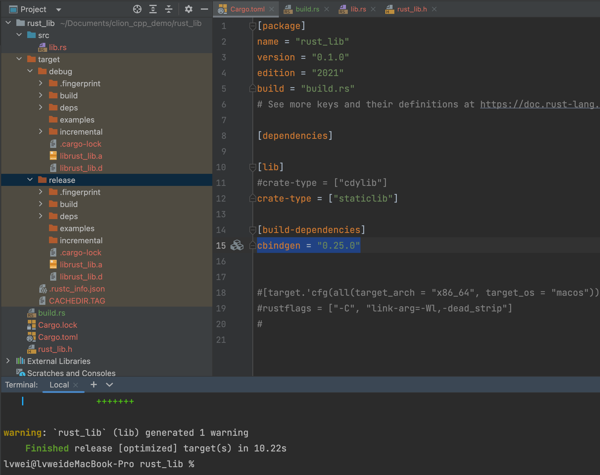
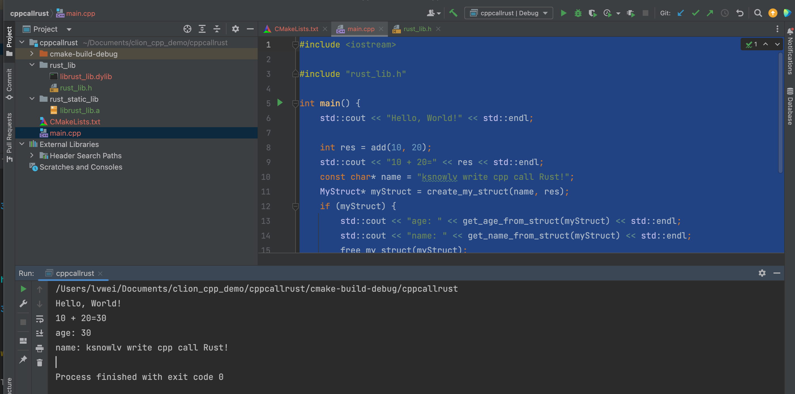

<!--more-->

## C++如何以库的形式调用rust

## 一.rust库工程

### 1.创建rust库工程

创建rust_lib库工程,工程目录如下

rust_lib \
---src \
------lib.rs\
---Cargo.toml\
---Cargo.lock

### 2.build.rs文件创建与配置

#### build.rs创建

```rust
extern crate cbindgen;

use std::env;

fn main() {
    let crate_dir = env::var("CARGO_MANIFEST_DIR").unwrap();

    cbindgen::Builder::new()
        .with_crate(crate_dir)
        .generate()
        .expect("Unable to generate bindings")
        .write_to_file("rust_lib.h");//生成头文件名称
}

```

#### build.rs配置
build.rs,用来在编译期间，生成rust库导出的.h头文件，工程目录如下

rust_lib\
---src \
------lib.rs \
---Cargo.toml \
---Cargo.lock \
---build.rs 

然后在Cargo.toml文件中，配置build.rs文件

```toml
[package]
name = "rust_lib"
version = "0.1.0"
edition = "2021"
#新增编译期间生成rust库导出的.h头文件
build = "build.rs"
```

### 3.Cargo.toml配置

```toml
[lib]
# 生成动态库
#crate-type = ["cdylib"]
# 生成静态库
crate-type = ["staticlib"]

[build-dependencies]
cbindgen = "0.25.0"

```

### 3.添加rust库导出类及函数

lib.rs内容

```rust
use std::os::raw::c_char;

// 使用 C 语言的结构体布局
#[repr(C)]
pub  struct MyStruct {
    pub name: *const c_char,
    pub age: i32,
}

#[no_mangle]
pub extern "C" fn create_my_struct( name: *const c_char, age: i32,) -> *mut MyStruct {
    Box::into_raw(Box::new(MyStruct { name, age }))
}

#[no_mangle]
pub extern "C" fn get_age_from_struct(ptr: *const MyStruct) -> i32 {
    unsafe {
        (*ptr).age
    }
}

#[no_mangle]
pub extern "C" fn get_name_from_struct(ptr: *const MyStruct) -> *const c_char {
    unsafe {
        (*ptr).name
    }
}

// 释放内存的函数
#[no_mangle]
pub extern "C" fn free_my_struct(ptr: *mut MyStruct) {
    unsafe {
        if !ptr.is_null() {
            let _ = Box::from_raw(ptr);
        }
    }
}

// 在 Rust 中定义一个简单的函数
#[no_mangle]
pub extern "C" fn add(a: i32, b: i32) -> i32 {
    return  a + b
}


```

### 4.生成静态库

使用cargo build生成debug版本库，如果是release版本,使用cargo build --release命令

```shell
lvwei@lvweideMacBook-Pro rust_lib % cargo build
   Compiling rust_lib v0.1.0 (/Users/lvwei/Documents/clion_cpp_demo/rust_lib)
    Finished dev [unoptimized + debuginfo] target(s) in 0.79s
    
#
 lvwei@lvweideMacBook-Pro rust_lib % cargo build --release
   Compiling proc-macro2 v1.0.78
   Compiling unicode-ident v1.0.12
   Compiling libc v0.2.152
   Compiling autocfg v1.1.0
   Compiling serde v1.0.195
   Compiling rustix v0.38.30
   Compiling os_str_bytes v6.6.1
   Compiling syn v1.0.109
   Compiling hashbrown v0.12.3
   Compiling serde_json v1.0.111
   Compiling indexmap v1.9.3
   Compiling bitflags v2.4.2
   Compiling clap_lex v0.2.4
   Compiling itoa v1.0.10
   Compiling ryu v1.0.16
   Compiling cfg-if v1.0.0
   Compiling fastrand v2.0.1
   Compiling termcolor v1.4.1
   Compiling textwrap v0.16.0
   Compiling bitflags v1.3.2
   Compiling cbindgen v0.25.0
   Compiling strsim v0.10.0
   Compiling log v0.4.20
   Compiling heck v0.4.1
   Compiling errno v0.3.8
   Compiling atty v0.2.14
   Compiling clap v3.2.25
   Compiling tempfile v3.9.0
   Compiling quote v1.0.35
   Compiling syn v2.0.48
   Compiling serde_derive v1.0.195
   Compiling toml v0.5.11
   Compiling rust_lib v0.1.0 (/Users/lvwei/Documents/clion_cpp_demo/rust_lib)
    Finished release [optimized] target(s) in 10.22s  
```




## 二.C++工程

### 1.创建C++工程

创建cppcallrust工程,把rust库头文件和动态库放到rust_lib目录，静态库放到rust_static_lib目录，
工程目录如下

cppcallrust \
---rust_lib \
------librust_lib.dylib\
------rust_lib.h\
---rust_static_lib\
------librust_lib.a\
---CMakeLists.txt\
---main.cpp

### 2.CMakeLists.txt配置

```CMakeLists.txt
cmake_minimum_required(VERSION 3.22)
project(cppcallrust)

set(CMAKE_CXX_STANDARD 14)

include_directories(rust_lib/)

#find_library(RUST_LIB rust_lib PATHS ${CMAKE_SOURCE_DIR}/rust_lib)
find_library(RUST_LIB rust_lib PATHS ${CMAKE_SOURCE_DIR}/rust_static_lib)

add_executable(cppcallrust main.cpp)

#add_library(rust_lib SHARED IMPORTED)
add_library(rust_lib STATIC IMPORTED)
set_target_properties(rust_lib PROPERTIES IMPORTED_LOCATION ${RUST_LIB})
target_link_libraries(${PROJECT_NAME} PRIVATE rust_lib)

```

### 2.rust_lib.h

```c++

#include <cstdarg>
#include <cstdint>
#include <cstdlib>
#include <ostream>
#include <new>

struct MyStruct {
  const char *name;
  int32_t age;
};

extern "C" {

MyStruct *create_my_struct(const char *name, int32_t age);

int32_t get_age_from_struct(const MyStruct *ptr);

const char *get_name_from_struct(const MyStruct *ptr);

void free_my_struct(MyStruct *ptr);

int32_t add(int32_t a, int32_t b);

} // extern "C"

```

### 3.main.cpp

```c++
#include <iostream>

#include "rust_lib.h"

int main() {
    std::cout << "Hello, World!" << std::endl;

    int res = add(10, 20);
    std::cout << "10 + 20=" << res << std::endl;
    const char* name = "ksnowlv write cpp call Rust!";
    MyStruct* myStruct = create_my_struct(name, res);
    if (myStruct) {
        std::cout << "age: " << get_age_from_struct(myStruct) << std::endl;
        std::cout << "name: " << get_name_from_struct(myStruct) << std::endl;
        free_my_struct(myStruct);
    }
    return 0;
}

```

### 4.执行情况





