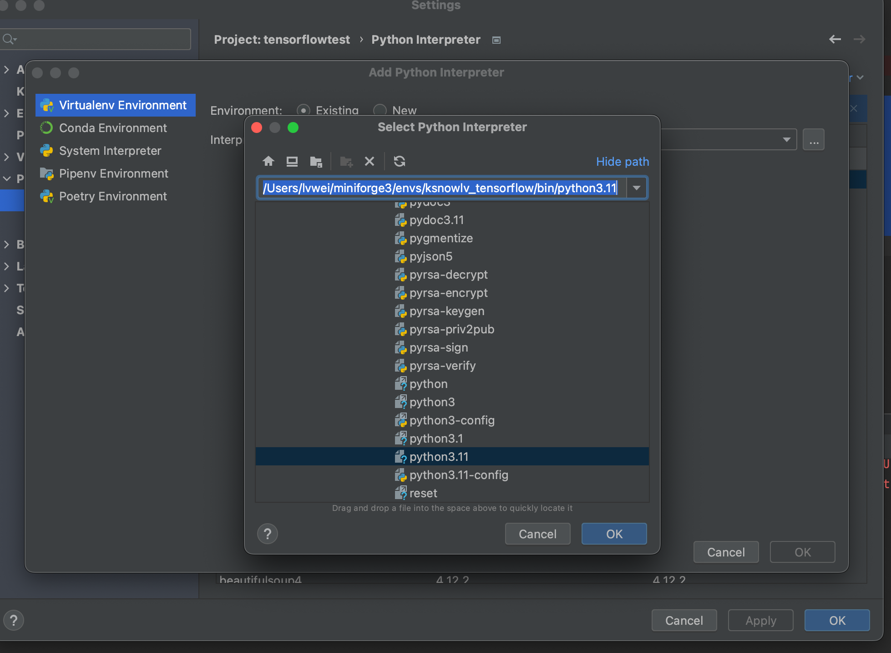
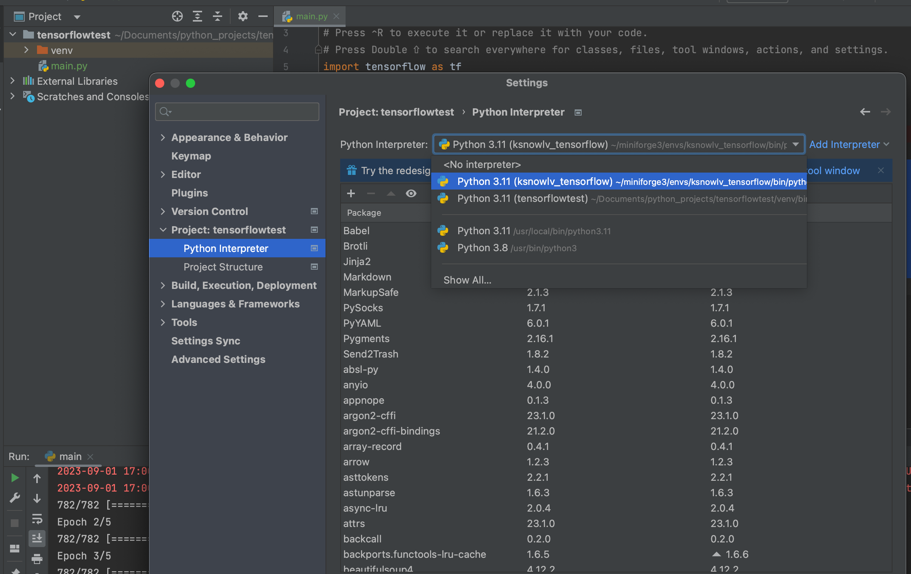

<!--more-->

## Mac 安装arm64版本 tensorflow

## 1.安装miniforge

在[https://github.com/conda-forge/miniforge](https://github.com/conda-forge/miniforge)下载arm64 (Apple Silicon) 版本的**miniforge**，下载完成后，在终端通过sh命令安装；按提示进行安装即可。

```terminal
lvwei@lvweideMacBook-Pro Downloads % sh Miniforge3-MacOSX-arm64.sh

Welcome to Miniforge3 23.3.1-0

In order to continue the installation process, please review the license
agreement.
Please, press ENTER to continue
>>> 
Miniforge installer code uses BSD-3-Clause license as stated below.

Binary packages that come with it have their own licensing terms
and by installing miniforge you agree to the licensing terms of individual
packages as well. They include different OSI-approved licenses including
the GNU General Public License and can be found in pkgs/<pkg-name>/info/licenses
folders.

Miniforge installer comes with a boostrapping executable that is used
when installing miniforge and is deleted after miniforge is installed.
The bootstrapping executable uses micromamba, cli11, cpp-filesystem,
curl, c-ares, krb5, libarchive, libev, lz4, nghttp2, openssl, libsolv,
nlohmann-json, reproc and zstd which are licensed under BSD-3-Clause,
MIT and OpenSSL licenses. Licenses and copyright notices of these
projects can be found at the following URL.
https://github.com/conda-forge/micromamba-feedstock/tree/master/recipe.

=============================================================================

Copyright (c) 2019-2022, conda-forge
All rights reserved.

Redistribution and use in source and binary forms, with or without
modification, are permitted provided that the following conditions are met:

1. Redistributions of source code must retain the above copyright notice, this
list of conditions and the following disclaimer.

2. Redistributions in binary form must reproduce the above copyright notice,
this list of conditions and the following disclaimer in the documentation
and/or other materials provided with the distribution.

3. Neither the name of the copyright holder nor the names of its contributors
may be used to endorse or promote products derived from this software without
specific prior written permission.

THIS SOFTWARE IS PROVIDED BY THE COPYRIGHT HOLDERS AND CONTRIBUTORS "AS IS" AND
ANY EXPRESS OR IMPLIED WARRANTIES, INCLUDING, BUT NOT LIMITED TO, THE IMPLIED
WARRANTIES OF MERCHANTABILITY AND FITNESS FOR A PARTICULAR PURPOSE ARE
DISCLAIMED. IN NO EVENT SHALL THE COPYRIGHT HOLDER OR CONTRIBUTORS BE LIABLE
FOR ANY DIRECT, INDIRECT, INCIDENTAL, SPECIAL, EXEMPLARY, OR CONSEQUENTIAL
DAMAGES (INCLUDING, BUT NOT LIMITED TO, PROCUREMENT OF SUBSTITUTE GOODS OR
SERVICES; LOSS OF USE, DATA, OR PROFITS; OR BUSINESS INTERRUPTION) HOWEVER
CAUSED AND ON ANY THEORY OF LIABILITY, WHETHER IN CONTRACT, STRICT LIABILITY,
OR TORT (INCLUDING NEGLIGENCE OR OTHERWISE) ARISING IN ANY WAY OUT OF THE USE
OF THIS SOFTWARE, EVEN IF ADVISED OF THE POSSIBILITY OF SUCH DAMAGE.


Do you accept the license terms? [yes|no]
[no] >>> yes

Miniforge3 will now be installed into this location:
/Users/lvwei/miniforge3

  - Press ENTER to confirm the location
  - Press CTRL-C to abort the installation
  - Or specify a different location below

[/Users/lvwei/miniforge3] >>> 
PREFIX=/Users/lvwei/miniforge3
Unpacking payload ...
Extracting bzip2-1.0.8-h3422bc3_4.tar.bz2
Extracting c-ares-1.19.1-hb547adb_0.conda
Extracting ca-certificates-2023.7.22-hf0a4a13_0.conda
Extracting icu-72.1-he12128b_0.conda
Extracting libcxx-16.0.6-h4653b0c_0.conda
Extracting libev-4.33-h642e427_1.tar.bz2
Extracting libffi-3.4.2-h3422bc3_5.tar.bz2
Extracting libiconv-1.17-he4db4b2_0.tar.bz2
Extracting libzlib-1.2.13-h53f4e23_5.conda
Extracting lzo-2.10-h642e427_1000.tar.bz2
Extracting ncurses-6.4-h7ea286d_0.conda
Extracting pybind11-abi-4-hd8ed1ab_3.tar.bz2
Extracting python_abi-3.10-3_cp310.conda
Extracting reproc-14.2.4-h1a8c8d9_0.conda
Extracting tzdata-2023c-h71feb2d_0.conda
Extracting xz-5.2.6-h57fd34a_0.tar.bz2
Extracting fmt-9.1.0-hffc8910_0.tar.bz2
Extracting libedit-3.1.20191231-hc8eb9b7_2.tar.bz2
Extracting libsolv-0.7.24-ha614eb4_1.conda
Extracting libsqlite-3.42.0-hb31c410_0.conda
Extracting libxml2-2.11.5-he3bdae6_0.conda
Extracting lz4-c-1.9.4-hb7217d7_0.conda
Extracting openssl-3.1.2-h53f4e23_0.conda
Extracting readline-8.2-h92ec313_1.conda
Extracting reproc-cpp-14.2.4-hb7217d7_0.conda
Extracting tk-8.6.12-he1e0b03_0.tar.bz2
Extracting yaml-cpp-0.7.0-hb7217d7_2.tar.bz2
Extracting zstd-1.5.2-h4f39d0f_7.conda
Extracting krb5-1.21.2-h92f50d5_0.conda
Extracting libarchive-3.6.2-h82b9b87_1.conda
Extracting libnghttp2-1.52.0-hae82a92_0.conda
Extracting libssh2-1.11.0-h7a5bd25_0.conda
Extracting python-3.10.12-h01493a6_0_cpython.conda
Extracting boltons-23.0.0-pyhd8ed1ab_0.conda
Extracting brotli-python-1.0.9-py310h0f1eb42_9.conda
Extracting certifi-2023.7.22-pyhd8ed1ab_0.conda
Extracting charset-normalizer-3.2.0-pyhd8ed1ab_0.conda
Extracting colorama-0.4.6-pyhd8ed1ab_0.tar.bz2
Extracting idna-3.4-pyhd8ed1ab_0.tar.bz2
Extracting jsonpointer-2.0-py_0.tar.bz2
Extracting libcurl-8.2.1-hc52a3a8_0.conda
Extracting packaging-23.1-pyhd8ed1ab_0.conda
Extracting pluggy-1.2.0-pyhd8ed1ab_0.conda
Extracting pycosat-0.6.4-py310h8e9501a_1.tar.bz2
Extracting pycparser-2.21-pyhd8ed1ab_0.tar.bz2
Extracting pysocks-1.7.1-pyha2e5f31_6.tar.bz2
Extracting ruamel.yaml.clib-0.2.7-py310h8e9501a_1.conda
Extracting setuptools-68.1.2-pyhd8ed1ab_0.conda
Extracting toolz-0.12.0-pyhd8ed1ab_0.tar.bz2
Extracting wheel-0.41.1-pyhd8ed1ab_0.conda
Extracting cffi-1.15.1-py310h2399d43_3.conda
Extracting jsonpatch-1.32-pyhd8ed1ab_0.tar.bz2
Extracting libmamba-1.4.2-h7d1d596_0.conda
Extracting pip-23.2.1-pyhd8ed1ab_0.conda
Extracting ruamel.yaml-0.17.32-py310h2aa6e3c_0.conda
Extracting tqdm-4.66.1-pyhd8ed1ab_0.conda
Extracting urllib3-2.0.4-pyhd8ed1ab_0.conda
Extracting cryptography-41.0.3-py310hdd3b5e7_0.conda
Extracting libmambapy-1.4.2-py310h34b6e76_0.conda
Extracting requests-2.31.0-pyhd8ed1ab_0.conda
Extracting zstandard-0.19.0-py310h07fcf8c_2.conda
Extracting conda-package-streaming-0.9.0-pyhd8ed1ab_0.conda
Extracting pyopenssl-23.2.0-pyhd8ed1ab_1.conda
Extracting conda-package-handling-2.2.0-pyh38be061_0.conda
Extracting conda-23.3.1-py310hbe9552e_0.conda
Extracting conda-libmamba-solver-23.3.0-pyhd8ed1ab_0.conda
Extracting mamba-1.4.2-py310ha5d4528_0.conda

Installing base environment...


                                           __
          __  ______ ___  ____ _____ ___  / /_  ____ _
         / / / / __ `__ \/ __ `/ __ `__ \/ __ \/ __ `/
        / /_/ / / / / / / /_/ / / / / / / /_/ / /_/ /
       / .___/_/ /_/ /_/\__,_/_/ /_/ /_/_.___/\__,_/
      /_/

Transaction

  Prefix: /Users/lvwei/miniforge3

  Updating specs:

   - conda-forge/osx-arm64::bzip2==1.0.8=h3422bc3_4[md5=fc76ace7b94fb1f694988ab1b14dd248]
   - conda-forge/osx-arm64::c-ares==1.19.1=hb547adb_0[md5=e7fc7430440d255e3a9c7e5a52f7b294]
   - conda-forge/osx-arm64::ca-certificates==2023.7.22=hf0a4a13_0[md5=e1b99ac4dbcee71a71682996f67f7965]
   - conda-forge/osx-arm64::icu==72.1=he12128b_0[md5=d1a11dfc54168a07856dbf87f393ca82]
   - conda-forge/osx-arm64::libcxx==16.0.6=h4653b0c_0[md5=9d7d724faf0413bf1dbc5a85935700c8]
   - conda-forge/osx-arm64::libev==4.33=h642e427_1[md5=566dbf70fe79eacdb3c3d3d195a27f55]
   - conda-forge/osx-arm64::libffi==3.4.2=h3422bc3_5[md5=086914b672be056eb70fd4285b6783b6]
   - conda-forge/osx-arm64::libiconv==1.17=he4db4b2_0[md5=686f9c755574aa221f29fbcf36a67265]
   - conda-forge/osx-arm64::libzlib==1.2.13=h53f4e23_5[md5=1a47f5236db2e06a320ffa0392f81bd8]
   - conda-forge/osx-arm64::lzo==2.10=h642e427_1000[md5=ddab5f96f5573a9bd5e24f9994fd6ec9]
   - conda-forge/osx-arm64::ncurses==6.4=h7ea286d_0[md5=318337fb9d0c53ba635efb7888242373]
   - conda-forge/noarch::pybind11-abi==4=hd8ed1ab_3[md5=878f923dd6acc8aeb47a75da6c4098be]
   - conda-forge/osx-arm64::python_abi==3.10=3_cp310[md5=3f2b2974db21a33a2f45b0c9abbb7516]
   - conda-forge/osx-arm64::reproc==14.2.4=h1a8c8d9_0[md5=2926452d62f061150e61a244557ab6a9]
   - conda-forge/noarch::tzdata==2023c=h71feb2d_0[md5=939e3e74d8be4dac89ce83b20de2492a]
   - conda-forge/osx-arm64::xz==5.2.6=h57fd34a_0[md5=39c6b54e94014701dd157f4f576ed211]
   - conda-forge/osx-arm64::fmt==9.1.0=hffc8910_0[md5=78c11e6b1e971d49e9610d856a845d2f]
   - conda-forge/osx-arm64::libedit==3.1.20191231=hc8eb9b7_2[md5=30e4362988a2623e9eb34337b83e01f9]
   - conda-forge/osx-arm64::libsolv==0.7.24=ha614eb4_1[md5=437f95666755b7ca5143fc11ace79331]
   - conda-forge/osx-arm64::libsqlite==3.42.0=hb31c410_0[md5=6ae1bbf3ae393a45a75685072fffbe8d]
   - conda-forge/osx-arm64::libxml2==2.11.5=he3bdae6_0[md5=2a3b45f84f55113ccfaf0ab6836152fa]
   - conda-forge/osx-arm64::lz4-c==1.9.4=hb7217d7_0[md5=45505bec548634f7d05e02fb25262cb9]
   - conda-forge/osx-arm64::openssl==3.1.2=h53f4e23_0[md5=d6c950611370a5a9757a98365449e89f]
   - conda-forge/osx-arm64::readline==8.2=h92ec313_1[md5=8cbb776a2f641b943d413b3e19df71f4]
   - conda-forge/osx-arm64::reproc-cpp==14.2.4=hb7217d7_0[md5=49f41035f14412b5b27d1e2382d00f02]
   - conda-forge/osx-arm64::tk==8.6.12=he1e0b03_0[md5=2cb3d18eac154109107f093860bd545f]
   - conda-forge/osx-arm64::yaml-cpp==0.7.0=hb7217d7_2[md5=1ba3d7af8b182ae33d49e4bb567076d3]
   - conda-forge/osx-arm64::zstd==1.5.2=h4f39d0f_7[md5=ac4a17e2fb251cbf3bce3aec64668ef2]
   - conda-forge/osx-arm64::krb5==1.21.2=h92f50d5_0[md5=92f1cff174a538e0722bf2efb16fc0b2]
   - conda-forge/osx-arm64::libarchive==3.6.2=h82b9b87_1[md5=0d82ec4537f2f581332087aac6e15ce1]
   - conda-forge/osx-arm64::libnghttp2==1.52.0=hae82a92_0[md5=1d319e95a0216f801293626a00337712]
   - conda-forge/osx-arm64::libssh2==1.11.0=h7a5bd25_0[md5=029f7dc931a3b626b94823bc77830b01]
   - conda-forge/osx-arm64::python==3.10.12=h01493a6_0_cpython[md5=a36e753b6c8875be1242229b3eabe907]
   - conda-forge/noarch::boltons==23.0.0=pyhd8ed1ab_0[md5=033eb25fffd222aceeca6d58cd953680]
   - conda-forge/osx-arm64::brotli-python==1.0.9=py310h0f1eb42_9[md5=907f4a8f11d2e49fcf85322a8b71a188]
   - conda-forge/noarch::certifi==2023.7.22=pyhd8ed1ab_0[md5=7f3dbc9179b4dde7da98dfb151d0ad22]
   - conda-forge/noarch::charset-normalizer==3.2.0=pyhd8ed1ab_0[md5=313516e9a4b08b12dfb1e1cd390a96e3]
   - conda-forge/noarch::colorama==0.4.6=pyhd8ed1ab_0[md5=3faab06a954c2a04039983f2c4a50d99]
   - conda-forge/noarch::idna==3.4=pyhd8ed1ab_0[md5=34272b248891bddccc64479f9a7fffed]
   - conda-forge/noarch::jsonpointer==2.0=py_0[md5=07d85c22a3beb102a48cd123df84c2a6]
   - conda-forge/osx-arm64::libcurl==8.2.1=hc52a3a8_0[md5=10cd3b7e1c73a47bb36d2cdce4504222]
   - conda-forge/noarch::packaging==23.1=pyhd8ed1ab_0[md5=91cda59e66e1e4afe9476f8ef98f5c30]
   - conda-forge/noarch::pluggy==1.2.0=pyhd8ed1ab_0[md5=7263924c642d22e311d9e59b839f1b33]
   - conda-forge/osx-arm64::pycosat==0.6.4=py310h8e9501a_1[md5=a4fc977e05bd8a0be63bd96f8625df8f]
   - conda-forge/noarch::pycparser==2.21=pyhd8ed1ab_0[md5=076becd9e05608f8dc72757d5f3a91ff]
   - conda-forge/noarch::pysocks==1.7.1=pyha2e5f31_6[md5=2a7de29fb590ca14b5243c4c812c8025]
   - conda-forge/osx-arm64::ruamel.yaml.clib==0.2.7=py310h8e9501a_1[md5=586a1f48c1daf7874844ab090af6f191]
   - conda-forge/noarch::setuptools==68.1.2=pyhd8ed1ab_0[md5=4fe12573bf499ff85a0a364e00cc5c53]
   - conda-forge/noarch::toolz==0.12.0=pyhd8ed1ab_0[md5=92facfec94bc02d6ccf42e7173831a36]
   - conda-forge/noarch::wheel==0.41.1=pyhd8ed1ab_0[md5=8f467ba2db2b5470d297953d9c1f9c7d]
   - conda-forge/osx-arm64::cffi==1.15.1=py310h2399d43_3[md5=d0ae0fd0363f0baef9d485c857d1d421]
   - conda-forge/noarch::jsonpatch==1.32=pyhd8ed1ab_0[md5=09150b51b0528a31a0f6500b96fdde82]
   - conda-forge/osx-arm64::libmamba==1.4.2=h7d1d596_0[md5=d7eab87c05033d40a0cb20fb19200d2e]
   - conda-forge/noarch::pip==23.2.1=pyhd8ed1ab_0[md5=e2783aa3f9235225eec92f9081c5b801]
   - conda-forge/osx-arm64::ruamel.yaml==0.17.32=py310h2aa6e3c_0[md5=b61412e35603edc1d049832cc60487f1]
   - conda-forge/noarch::tqdm==4.66.1=pyhd8ed1ab_0[md5=03c97908b976498dcae97eb4e4f3149c]
   - conda-forge/noarch::urllib3==2.0.4=pyhd8ed1ab_0[md5=18badd8fa3648d1beb1fcc7f2e0f756e]
   - conda-forge/osx-arm64::cryptography==41.0.3=py310hdd3b5e7_0[md5=dc4c09a48917e775bddf3650aea90abe]
   - conda-forge/osx-arm64::libmambapy==1.4.2=py310h34b6e76_0[md5=27a7a976a4e088c1c152846c78ccd144]
   - conda-forge/noarch::requests==2.31.0=pyhd8ed1ab_0[md5=a30144e4156cdbb236f99ebb49828f8b]
   - conda-forge/osx-arm64::zstandard==0.19.0=py310h07fcf8c_2[md5=b391d0870045458d9f4f89aac38ccf9f]
   - conda-forge/noarch::conda-package-streaming==0.9.0=pyhd8ed1ab_0[md5=38253361efb303deead3eab39ae9269b]
   - conda-forge/noarch::pyopenssl==23.2.0=pyhd8ed1ab_1[md5=34f7d568bf59d18e3fef8c405cbece21]
   - conda-forge/noarch::conda-package-handling==2.2.0=pyh38be061_0[md5=8a3ae7f6318376aa08ea753367bb7dd6]
   - conda-forge/osx-arm64::conda==23.3.1=py310hbe9552e_0[md5=bb80dab2f217acc17ee10e3a011084ca]
   - conda-forge/noarch::conda-libmamba-solver==23.3.0=pyhd8ed1ab_0[md5=2edd368915b8a1c3e294c9ac944390d9]
   - conda-forge/osx-arm64::mamba==1.4.2=py310ha5d4528_0[md5=6725b97608b0f12df620ea2d10566f4c]


  Package                         Version  Build               Channel           Size
───────────────────────────────────────────────────────────────────────────────────────
  Install:
───────────────────────────────────────────────────────────────────────────────────────

  + boltons                        23.0.0  pyhd8ed1ab_0        conda-forge     Cached
  + brotli-python                   1.0.9  py310h0f1eb42_9     conda-forge     Cached
  + bzip2                           1.0.8  h3422bc3_4          conda-forge     Cached
  + c-ares                         1.19.1  hb547adb_0          conda-forge     Cached
  + ca-certificates             2023.7.22  hf0a4a13_0          conda-forge     Cached
  + certifi                     2023.7.22  pyhd8ed1ab_0        conda-forge     Cached
  + cffi                           1.15.1  py310h2399d43_3     conda-forge     Cached
  + charset-normalizer              3.2.0  pyhd8ed1ab_0        conda-forge     Cached
  + colorama                        0.4.6  pyhd8ed1ab_0        conda-forge     Cached
  + conda                          23.3.1  py310hbe9552e_0     conda-forge     Cached
  + conda-libmamba-solver          23.3.0  pyhd8ed1ab_0        conda-forge     Cached
  + conda-package-handling          2.2.0  pyh38be061_0        conda-forge     Cached
  + conda-package-streaming         0.9.0  pyhd8ed1ab_0        conda-forge     Cached
  + cryptography                   41.0.3  py310hdd3b5e7_0     conda-forge     Cached
  + fmt                             9.1.0  hffc8910_0          conda-forge     Cached
  + icu                              72.1  he12128b_0          conda-forge     Cached
  + idna                              3.4  pyhd8ed1ab_0        conda-forge     Cached
  + jsonpatch                        1.32  pyhd8ed1ab_0        conda-forge     Cached
  + jsonpointer                       2.0  py_0                conda-forge     Cached
  + krb5                           1.21.2  h92f50d5_0          conda-forge     Cached
  + libarchive                      3.6.2  h82b9b87_1          conda-forge     Cached
  + libcurl                         8.2.1  hc52a3a8_0          conda-forge     Cached
  + libcxx                         16.0.6  h4653b0c_0          conda-forge     Cached
  + libedit                  3.1.20191231  hc8eb9b7_2          conda-forge     Cached
  + libev                            4.33  h642e427_1          conda-forge     Cached
  + libffi                          3.4.2  h3422bc3_5          conda-forge     Cached
  + libiconv                         1.17  he4db4b2_0          conda-forge     Cached
  + libmamba                        1.4.2  h7d1d596_0          conda-forge     Cached
  + libmambapy                      1.4.2  py310h34b6e76_0     conda-forge     Cached
  + libnghttp2                     1.52.0  hae82a92_0          conda-forge     Cached
  + libsolv                        0.7.24  ha614eb4_1          conda-forge     Cached
  + libsqlite                      3.42.0  hb31c410_0          conda-forge     Cached
  + libssh2                        1.11.0  h7a5bd25_0          conda-forge     Cached
  + libxml2                        2.11.5  he3bdae6_0          conda-forge     Cached
  + libzlib                        1.2.13  h53f4e23_5          conda-forge     Cached
  + lz4-c                           1.9.4  hb7217d7_0          conda-forge     Cached
  + lzo                              2.10  h642e427_1000       conda-forge     Cached
  + mamba                           1.4.2  py310ha5d4528_0     conda-forge     Cached
  + ncurses                           6.4  h7ea286d_0          conda-forge     Cached
  + openssl                         3.1.2  h53f4e23_0          conda-forge     Cached
  + packaging                        23.1  pyhd8ed1ab_0        conda-forge     Cached
  + pip                            23.2.1  pyhd8ed1ab_0        conda-forge     Cached
  + pluggy                          1.2.0  pyhd8ed1ab_0        conda-forge     Cached
  + pybind11-abi                        4  hd8ed1ab_3          conda-forge     Cached
  + pycosat                         0.6.4  py310h8e9501a_1     conda-forge     Cached
  + pycparser                        2.21  pyhd8ed1ab_0        conda-forge     Cached
  + pyopenssl                      23.2.0  pyhd8ed1ab_1        conda-forge     Cached
  + pysocks                         1.7.1  pyha2e5f31_6        conda-forge     Cached
  + python                        3.10.12  h01493a6_0_cpython  conda-forge     Cached
  + python_abi                       3.10  3_cp310             conda-forge     Cached
  + readline                          8.2  h92ec313_1          conda-forge     Cached
  + reproc                         14.2.4  h1a8c8d9_0          conda-forge     Cached
  + reproc-cpp                     14.2.4  hb7217d7_0          conda-forge     Cached
  + requests                       2.31.0  pyhd8ed1ab_0        conda-forge     Cached
  + ruamel.yaml                   0.17.32  py310h2aa6e3c_0     conda-forge     Cached
  + ruamel.yaml.clib                0.2.7  py310h8e9501a_1     conda-forge     Cached
  + setuptools                     68.1.2  pyhd8ed1ab_0        conda-forge     Cached
  + tk                             8.6.12  he1e0b03_0          conda-forge     Cached
  + toolz                          0.12.0  pyhd8ed1ab_0        conda-forge     Cached
  + tqdm                           4.66.1  pyhd8ed1ab_0        conda-forge     Cached
  + tzdata                          2023c  h71feb2d_0          conda-forge     Cached
  + urllib3                         2.0.4  pyhd8ed1ab_0        conda-forge     Cached
  + wheel                          0.41.1  pyhd8ed1ab_0        conda-forge     Cached
  + xz                              5.2.6  h57fd34a_0          conda-forge     Cached
  + yaml-cpp                        0.7.0  hb7217d7_2          conda-forge     Cached
  + zstandard                      0.19.0  py310h07fcf8c_2     conda-forge     Cached
  + zstd                            1.5.2  h4f39d0f_7          conda-forge     Cached

  Summary:

  Install: 67 packages

  Total download: 0 B

───────────────────────────────────────────────────────────────────────────────────────


Transaction starting
Linking bzip2-1.0.8-h3422bc3_4
Linking c-ares-1.19.1-hb547adb_0
Linking ca-certificates-2023.7.22-hf0a4a13_0
Linking icu-72.1-he12128b_0
Linking libcxx-16.0.6-h4653b0c_0
Linking libev-4.33-h642e427_1
Linking libffi-3.4.2-h3422bc3_5
Linking libiconv-1.17-he4db4b2_0
Linking libzlib-1.2.13-h53f4e23_5
Linking lzo-2.10-h642e427_1000
Linking ncurses-6.4-h7ea286d_0
Linking pybind11-abi-4-hd8ed1ab_3
Linking python_abi-3.10-3_cp310
Linking reproc-14.2.4-h1a8c8d9_0
Linking tzdata-2023c-h71feb2d_0
Linking xz-5.2.6-h57fd34a_0
Linking fmt-9.1.0-hffc8910_0
Linking libedit-3.1.20191231-hc8eb9b7_2
Linking libsolv-0.7.24-ha614eb4_1
Linking libsqlite-3.42.0-hb31c410_0
Linking libxml2-2.11.5-he3bdae6_0
Linking lz4-c-1.9.4-hb7217d7_0
Linking openssl-3.1.2-h53f4e23_0
Linking readline-8.2-h92ec313_1
Linking reproc-cpp-14.2.4-hb7217d7_0
Linking tk-8.6.12-he1e0b03_0
Linking yaml-cpp-0.7.0-hb7217d7_2
Linking zstd-1.5.2-h4f39d0f_7
Linking krb5-1.21.2-h92f50d5_0
Linking libarchive-3.6.2-h82b9b87_1
Linking libnghttp2-1.52.0-hae82a92_0
Linking libssh2-1.11.0-h7a5bd25_0
Linking python-3.10.12-h01493a6_0_cpython
Linking boltons-23.0.0-pyhd8ed1ab_0
Linking brotli-python-1.0.9-py310h0f1eb42_9
Linking certifi-2023.7.22-pyhd8ed1ab_0
Linking charset-normalizer-3.2.0-pyhd8ed1ab_0
Linking colorama-0.4.6-pyhd8ed1ab_0
Linking idna-3.4-pyhd8ed1ab_0
Linking jsonpointer-2.0-py_0
Linking libcurl-8.2.1-hc52a3a8_0
Linking packaging-23.1-pyhd8ed1ab_0
Linking pluggy-1.2.0-pyhd8ed1ab_0
Linking pycosat-0.6.4-py310h8e9501a_1
Linking pycparser-2.21-pyhd8ed1ab_0
Linking pysocks-1.7.1-pyha2e5f31_6
Linking ruamel.yaml.clib-0.2.7-py310h8e9501a_1
Linking setuptools-68.1.2-pyhd8ed1ab_0
Linking toolz-0.12.0-pyhd8ed1ab_0
Linking wheel-0.41.1-pyhd8ed1ab_0
Linking cffi-1.15.1-py310h2399d43_3
Linking jsonpatch-1.32-pyhd8ed1ab_0
Linking libmamba-1.4.2-h7d1d596_0
Linking pip-23.2.1-pyhd8ed1ab_0
Linking ruamel.yaml-0.17.32-py310h2aa6e3c_0
Linking tqdm-4.66.1-pyhd8ed1ab_0
Linking urllib3-2.0.4-pyhd8ed1ab_0
Linking cryptography-41.0.3-py310hdd3b5e7_0
Linking libmambapy-1.4.2-py310h34b6e76_0
Linking requests-2.31.0-pyhd8ed1ab_0
Linking zstandard-0.19.0-py310h07fcf8c_2
Linking conda-package-streaming-0.9.0-pyhd8ed1ab_0
Linking pyopenssl-23.2.0-pyhd8ed1ab_1
Linking conda-package-handling-2.2.0-pyh38be061_0
Linking conda-23.3.1-py310hbe9552e_0
Linking conda-libmamba-solver-23.3.0-pyhd8ed1ab_0
Linking mamba-1.4.2-py310ha5d4528_0
Transaction finished
installation finished.
Do you wish the installer to initialize Miniforge3
by running conda init? [yes|no]
[no] >>> yes

no change     /Users/lvwei/miniforge3/condabin/conda
no change     /Users/lvwei/miniforge3/bin/conda
no change     /Users/lvwei/miniforge3/bin/conda-env
no change     /Users/lvwei/miniforge3/bin/activate
no change     /Users/lvwei/miniforge3/bin/deactivate
no change     /Users/lvwei/miniforge3/etc/profile.d/conda.sh
no change     /Users/lvwei/miniforge3/etc/fish/conf.d/conda.fish
no change     /Users/lvwei/miniforge3/shell/condabin/Conda.psm1
no change     /Users/lvwei/miniforge3/shell/condabin/conda-hook.ps1
no change     /Users/lvwei/miniforge3/lib/python3.10/site-packages/xontrib/conda.xsh
no change     /Users/lvwei/miniforge3/etc/profile.d/conda.csh
modified      /Users/lvwei/.zshrc

==> For changes to take effect, close and re-open your current shell. <==


                  __    __    __    __
                 /  \  /  \  /  \  /  \
                /    \/    \/    \/    \
███████████████/  /██/  /██/  /██/  /████████████████████████
              /  / \   / \   / \   / \  \____
             /  /   \_/   \_/   \_/   \    o \__,
            / _/                       \_____/  `
            |/
        ███╗   ███╗ █████╗ ███╗   ███╗██████╗  █████╗
        ████╗ ████║██╔══██╗████╗ ████║██╔══██╗██╔══██╗
        ██╔████╔██║███████║██╔████╔██║██████╔╝███████║
        ██║╚██╔╝██║██╔══██║██║╚██╔╝██║██╔══██╗██╔══██║
        ██║ ╚═╝ ██║██║  ██║██║ ╚═╝ ██║██████╔╝██║  ██║
        ╚═╝     ╚═╝╚═╝  ╚═╝╚═╝     ╚═╝╚═════╝ ╚═╝  ╚═╝

        mamba (1.4.2) supported by @QuantStack

        GitHub:  https://github.com/mamba-org/mamba
        Twitter: https://twitter.com/QuantStack

█████████████████████████████████████████████████████████████

no change     /Users/lvwei/miniforge3/condabin/conda
no change     /Users/lvwei/miniforge3/bin/conda
no change     /Users/lvwei/miniforge3/bin/conda-env
no change     /Users/lvwei/miniforge3/bin/activate
no change     /Users/lvwei/miniforge3/bin/deactivate
no change     /Users/lvwei/miniforge3/etc/profile.d/conda.sh
no change     /Users/lvwei/miniforge3/etc/fish/conf.d/conda.fish
no change     /Users/lvwei/miniforge3/shell/condabin/Conda.psm1
no change     /Users/lvwei/miniforge3/shell/condabin/conda-hook.ps1
no change     /Users/lvwei/miniforge3/lib/python3.10/site-packages/xontrib/conda.xsh
no change     /Users/lvwei/miniforge3/etc/profile.d/conda.csh
no change     /Users/lvwei/.zshrc
No action taken.
Added mamba to /Users/lvwei/.zshrc

==> For changes to take effect, close and re-open your current shell. <==

If you'd prefer that conda's base environment not be activated on startup, 
   set the auto_activate_base parameter to false: 

conda config --set auto_activate_base false

Thank you for installing Miniforge3!
```

## 2.创建虚拟环境

命令如下：

```terminal
conda create -n 虚拟环境名称 python=版本号
```

我机器上python版本为3.11.5，示例

```terminal
 conda create -n ksnowlv_tensorflow python=3.11 
```

执行情况：

```terminal
 lvwei@lvweideMacBook-Pro ~ % conda create -n ksnowlv_tensorflow python=3.11.5
Collecting package metadata (current_repodata.json): done
Solving environment: done


==> WARNING: A newer version of conda exists. <==
  current version: 23.3.1
  latest version: 23.7.3

Please update conda by running

    $ conda update -n base -c conda-forge conda

Or to minimize the number of packages updated during conda update use

     conda install conda=23.7.3


## Package Plan ##

  environment location: /Users/lvwei/miniforge3/envs/ksnowlv_tensorflow

  added / updated specs:
    - python=3.11.5


The following packages will be downloaded:

    package                    |            build
    ---------------------------|-----------------
    libexpat-2.5.0             |       hb7217d7_1          62 KB  conda-forge
    libsqlite-3.43.0           |       hb31c410_0         815 KB  conda-forge
    python-3.11.5              |h47c9636_0_cpython        14.0 MB  conda-forge
    wheel-0.41.2               |     pyhd8ed1ab_0          56 KB  conda-forge
    ------------------------------------------------------------
                                           Total:        14.9 MB

The following NEW packages will be INSTALLED:

  bzip2              conda-forge/osx-arm64::bzip2-1.0.8-h3422bc3_4 
  ca-certificates    conda-forge/osx-arm64::ca-certificates-2023.7.22-hf0a4a13_0 
  libexpat           conda-forge/osx-arm64::libexpat-2.5.0-hb7217d7_1 
  libffi             conda-forge/osx-arm64::libffi-3.4.2-h3422bc3_5 
  libsqlite          conda-forge/osx-arm64::libsqlite-3.43.0-hb31c410_0 
  libzlib            conda-forge/osx-arm64::libzlib-1.2.13-h53f4e23_5 
  ncurses            conda-forge/osx-arm64::ncurses-6.4-h7ea286d_0 
  openssl            conda-forge/osx-arm64::openssl-3.1.2-h53f4e23_0 
  pip                conda-forge/noarch::pip-23.2.1-pyhd8ed1ab_0 
  python             conda-forge/osx-arm64::python-3.11.5-h47c9636_0_cpython 
  readline           conda-forge/osx-arm64::readline-8.2-h92ec313_1 
  setuptools         conda-forge/noarch::setuptools-68.1.2-pyhd8ed1ab_0 
  tk                 conda-forge/osx-arm64::tk-8.6.12-he1e0b03_0 
  tzdata             conda-forge/noarch::tzdata-2023c-h71feb2d_0 
  wheel              conda-forge/noarch::wheel-0.41.2-pyhd8ed1ab_0 
  xz                 conda-forge/osx-arm64::xz-5.2.6-h57fd34a_0 


Proceed ([y]/n)? y


Downloading and Extracting Packages
                                                                                                                                                      
Preparing transaction: done                                                                                                                           
Verifying transaction: done                                                                                                                           
Executing transaction: done                                                                                                                           
#
# To activate this environment, use
#
#     $ conda activate ksnowlv_tensorflow
#
# To deactivate an active environment, use
#
#     $ conda deactivate

```

## 3.激活虚拟环境

* 命令格式

```terminal
conda activate 虚拟环境名
```

* 示例

```terminal
 conda activate ksnowlv_tensorflow
```

* 执行情况：

```terminal
(ksnowlv_tensorflow) lvwei@lvweideMacBook-Pro ~ % conda activate ksnowlv_tensorflow 
```

如果需要取消激活，可以使用**conda deactivate**命令。

## 4.安装tensorflow

考虑到下载速度，使用国内清华的镜像https://pypi.tuna.tsinghua.edu.cn/simple/

* 示例
```terminal
arch -arm64 pip3 install -i https://pypi.tuna.tsinghua.edu.cn/simple/ --upgrade tensorflow 
```

* 执行情况

```terminal
(ksnowlv_tensorflow) lvwei@lvweideMacBook-Pro ~ % arch -arm64 pip3 install -i https://pypi.tuna.tsinghua.edu.cn/simple/ --upgrade tensorflow      
Looking in indexes: https://pypi.tuna.tsinghua.edu.cn/simple/
Collecting tensorflow
  Using cached https://pypi.tuna.tsinghua.edu.cn/packages/d6/69/d461fa09235326e08b7ca463d5491426fdd4908ef6d3f9ed51d0777dc071/tensorflow-2.13.0-cp311-cp311-macosx_12_0_arm64.whl (1.9 kB)
Collecting tensorflow-macos==2.13.0 (from tensorflow)
  Using cached https://pypi.tuna.tsinghua.edu.cn/packages/f1/cc/6c262ae6f3a23b118b1104fa5f6126067744ffa9226faade202b0a20bdd3/tensorflow_macos-2.13.0-cp311-cp311-macosx_12_0_arm64.whl (189.3 MB)
Collecting absl-py>=1.0.0 (from tensorflow-macos==2.13.0->tensorflow)
  Using cached https://pypi.tuna.tsinghua.edu.cn/packages/dd/87/de5c32fa1b1c6c3305d576e299801d8655c175ca9557019906247b994331/absl_py-1.4.0-py3-none-any.whl (126 kB)
Collecting astunparse>=1.6.0 (from tensorflow-macos==2.13.0->tensorflow)
  Using cached https://pypi.tuna.tsinghua.edu.cn/packages/2b/03/13dde6512ad7b4557eb792fbcf0c653af6076b81e5941d36ec61f7ce6028/astunparse-1.6.3-py2.py3-none-any.whl (12 kB)
Collecting flatbuffers>=23.1.21 (from tensorflow-macos==2.13.0->tensorflow)
  Using cached https://pypi.tuna.tsinghua.edu.cn/packages/6f/12/d5c79ee252793ffe845d58a913197bfa02ae9a0b5c9bc3dc4b58d477b9e7/flatbuffers-23.5.26-py2.py3-none-any.whl (26 kB)
Collecting gast<=0.4.0,>=0.2.1 (from tensorflow-macos==2.13.0->tensorflow)
  Using cached https://pypi.tuna.tsinghua.edu.cn/packages/b6/48/583c032b79ae5b3daa02225a675aeb673e58d2cb698e78510feceb11958c/gast-0.4.0-py3-none-any.whl (9.8 kB)
Collecting google-pasta>=0.1.1 (from tensorflow-macos==2.13.0->tensorflow)
  Using cached https://pypi.tuna.tsinghua.edu.cn/packages/a3/de/c648ef6835192e6e2cc03f40b19eeda4382c49b5bafb43d88b931c4c74ac/google_pasta-0.2.0-py3-none-any.whl (57 kB)
Collecting h5py>=2.9.0 (from tensorflow-macos==2.13.0->tensorflow)
  Using cached https://pypi.tuna.tsinghua.edu.cn/packages/37/82/859d9fc800a316e692bd040437d45613512b43d49fb0435c5bbab9e71511/h5py-3.9.0-cp311-cp311-macosx_11_0_arm64.whl (2.6 MB)
Collecting libclang>=13.0.0 (from tensorflow-macos==2.13.0->tensorflow)
  Using cached https://pypi.tuna.tsinghua.edu.cn/packages/32/1f/981809b77b71972beec34b3ff5422c1b1f7e519daac7b3cbd055c05ba2cf/libclang-16.0.6-py2.py3-none-macosx_11_0_arm64.whl (20.6 MB)
Collecting numpy<=1.24.3,>=1.22 (from tensorflow-macos==2.13.0->tensorflow)
  Using cached https://pypi.tuna.tsinghua.edu.cn/packages/ee/6c/7217a8844dfe22e349bccbecd35571fa72c5d7fe8b33d8c5540e8cc2535c/numpy-1.24.3-cp311-cp311-macosx_11_0_arm64.whl (13.8 MB)
Collecting opt-einsum>=2.3.2 (from tensorflow-macos==2.13.0->tensorflow)
  Using cached https://pypi.tuna.tsinghua.edu.cn/packages/bc/19/404708a7e54ad2798907210462fd950c3442ea51acc8790f3da48d2bee8b/opt_einsum-3.3.0-py3-none-any.whl (65 kB)
Collecting packaging (from tensorflow-macos==2.13.0->tensorflow)
  Using cached https://pypi.tuna.tsinghua.edu.cn/packages/ab/c3/57f0601a2d4fe15de7a553c00adbc901425661bf048f2a22dfc500caf121/packaging-23.1-py3-none-any.whl (48 kB)
Collecting protobuf!=4.21.0,!=4.21.1,!=4.21.2,!=4.21.3,!=4.21.4,!=4.21.5,<5.0.0dev,>=3.20.3 (from tensorflow-macos==2.13.0->tensorflow)
  Using cached https://pypi.tuna.tsinghua.edu.cn/packages/ac/8f/a7e5dfc2d285526c74b82f118d5b4857875f39405aa1d6f1df56ef25a070/protobuf-4.24.2-cp37-abi3-macosx_10_9_universal2.whl (409 kB)
Requirement already satisfied: setuptools in ./miniforge3/envs/ksnowlv_tensorflow/lib/python3.11/site-packages (from tensorflow-macos==2.13.0->tensorflow) (68.1.2)
Collecting six>=1.12.0 (from tensorflow-macos==2.13.0->tensorflow)
  Using cached https://pypi.tuna.tsinghua.edu.cn/packages/d9/5a/e7c31adbe875f2abbb91bd84cf2dc52d792b5a01506781dbcf25c91daf11/six-1.16.0-py2.py3-none-any.whl (11 kB)
Collecting termcolor>=1.1.0 (from tensorflow-macos==2.13.0->tensorflow)
  Using cached https://pypi.tuna.tsinghua.edu.cn/packages/67/e1/434566ffce04448192369c1a282931cf4ae593e91907558eaecd2e9f2801/termcolor-2.3.0-py3-none-any.whl (6.9 kB)
Collecting typing-extensions<4.6.0,>=3.6.6 (from tensorflow-macos==2.13.0->tensorflow)
  Using cached https://pypi.tuna.tsinghua.edu.cn/packages/31/25/5abcd82372d3d4a3932e1fa8c3dbf9efac10cc7c0d16e78467460571b404/typing_extensions-4.5.0-py3-none-any.whl (27 kB)
Collecting wrapt>=1.11.0 (from tensorflow-macos==2.13.0->tensorflow)
  Using cached https://pypi.tuna.tsinghua.edu.cn/packages/6b/b0/bde5400fdf6d18cb7ef527831de0f86ac206c4da1670b67633e5a547b05f/wrapt-1.15.0-cp311-cp311-macosx_11_0_arm64.whl (36 kB)
Collecting grpcio<2.0,>=1.24.3 (from tensorflow-macos==2.13.0->tensorflow)
  Using cached https://pypi.tuna.tsinghua.edu.cn/packages/7d/95/95040281591928aa8428737df2963b90f7a690d2d583484df81ac292e715/grpcio-1.57.0-cp311-cp311-macosx_10_10_universal2.whl (9.0 MB)
Collecting tensorboard<2.14,>=2.13 (from tensorflow-macos==2.13.0->tensorflow)
  Using cached https://pypi.tuna.tsinghua.edu.cn/packages/67/f2/e8be5599634ff063fa2c59b7b51636815909d5140a26df9f02ce5d99b81a/tensorboard-2.13.0-py3-none-any.whl (5.6 MB)
Collecting tensorflow-estimator<2.14,>=2.13.0 (from tensorflow-macos==2.13.0->tensorflow)
  Using cached https://pypi.tuna.tsinghua.edu.cn/packages/72/5c/c318268d96791c6222ad7df1651bbd1b2409139afeb6f468c0f327177016/tensorflow_estimator-2.13.0-py2.py3-none-any.whl (440 kB)
Collecting keras<2.14,>=2.13.1 (from tensorflow-macos==2.13.0->tensorflow)
  Using cached https://pypi.tuna.tsinghua.edu.cn/packages/2e/f3/19da7511b45e80216cbbd9467137b2d28919c58ba1ccb971435cb631e470/keras-2.13.1-py3-none-any.whl (1.7 MB)
Requirement already satisfied: wheel<1.0,>=0.23.0 in ./miniforge3/envs/ksnowlv_tensorflow/lib/python3.11/site-packages (from astunparse>=1.6.0->tensorflow-macos==2.13.0->tensorflow) (0.41.2)
Collecting google-auth<3,>=1.6.3 (from tensorboard<2.14,>=2.13->tensorflow-macos==2.13.0->tensorflow)
  Using cached https://pypi.tuna.tsinghua.edu.cn/packages/9c/8d/bff87fc722553a5691d8514da5523c23547f3894189ba03b57592e37bdc2/google_auth-2.22.0-py2.py3-none-any.whl (181 kB)
Collecting google-auth-oauthlib<1.1,>=0.5 (from tensorboard<2.14,>=2.13->tensorflow-macos==2.13.0->tensorflow)
  Using cached https://pypi.tuna.tsinghua.edu.cn/packages/4a/07/8d9a8186e6768b55dfffeb57c719bc03770cf8a970a074616ae6f9e26a57/google_auth_oauthlib-1.0.0-py2.py3-none-any.whl (18 kB)
Collecting markdown>=2.6.8 (from tensorboard<2.14,>=2.13->tensorflow-macos==2.13.0->tensorflow)
  Using cached https://pypi.tuna.tsinghua.edu.cn/packages/1a/b5/228c1cdcfe138f1a8e01ab1b54284c8b83735476cb22b6ba251656ed13ad/Markdown-3.4.4-py3-none-any.whl (94 kB)
Collecting requests<3,>=2.21.0 (from tensorboard<2.14,>=2.13->tensorflow-macos==2.13.0->tensorflow)
  Using cached https://pypi.tuna.tsinghua.edu.cn/packages/70/8e/0e2d847013cb52cd35b38c009bb167a1a26b2ce6cd6965bf26b47bc0bf44/requests-2.31.0-py3-none-any.whl (62 kB)
Collecting tensorboard-data-server<0.8.0,>=0.7.0 (from tensorboard<2.14,>=2.13->tensorflow-macos==2.13.0->tensorflow)
  Using cached https://pypi.tuna.tsinghua.edu.cn/packages/da/61/6e9ff8258422d287eec718872fb71e05324356722ab658c8afda25f51539/tensorboard_data_server-0.7.1-py3-none-any.whl (2.4 kB)
Collecting werkzeug>=1.0.1 (from tensorboard<2.14,>=2.13->tensorflow-macos==2.13.0->tensorflow)
  Using cached https://pypi.tuna.tsinghua.edu.cn/packages/9b/59/a7c32e3d8d0e546a206e0552a2c04444544f15c1da4a01df8938d20c6ffc/werkzeug-2.3.7-py3-none-any.whl (242 kB)
Collecting cachetools<6.0,>=2.0.0 (from google-auth<3,>=1.6.3->tensorboard<2.14,>=2.13->tensorflow-macos==2.13.0->tensorflow)
  Using cached https://pypi.tuna.tsinghua.edu.cn/packages/a9/c9/c8a7710f2cedcb1db9224fdd4d8307c9e48cbddc46c18b515fefc0f1abbe/cachetools-5.3.1-py3-none-any.whl (9.3 kB)
Collecting pyasn1-modules>=0.2.1 (from google-auth<3,>=1.6.3->tensorboard<2.14,>=2.13->tensorflow-macos==2.13.0->tensorflow)
  Using cached https://pypi.tuna.tsinghua.edu.cn/packages/cd/8e/bea464350e1b8c6ed0da3a312659cb648804a08af6cacc6435867f74f8bd/pyasn1_modules-0.3.0-py2.py3-none-any.whl (181 kB)
Collecting rsa<5,>=3.1.4 (from google-auth<3,>=1.6.3->tensorboard<2.14,>=2.13->tensorflow-macos==2.13.0->tensorflow)
  Using cached https://pypi.tuna.tsinghua.edu.cn/packages/49/97/fa78e3d2f65c02c8e1268b9aba606569fe97f6c8f7c2d74394553347c145/rsa-4.9-py3-none-any.whl (34 kB)
Collecting urllib3<2.0 (from google-auth<3,>=1.6.3->tensorboard<2.14,>=2.13->tensorflow-macos==2.13.0->tensorflow)
  Using cached https://pypi.tuna.tsinghua.edu.cn/packages/c5/05/c214b32d21c0b465506f95c4f28ccbcba15022e000b043b72b3df7728471/urllib3-1.26.16-py2.py3-none-any.whl (143 kB)
Collecting requests-oauthlib>=0.7.0 (from google-auth-oauthlib<1.1,>=0.5->tensorboard<2.14,>=2.13->tensorflow-macos==2.13.0->tensorflow)
  Using cached https://pypi.tuna.tsinghua.edu.cn/packages/6f/bb/5deac77a9af870143c684ab46a7934038a53eb4aa975bc0687ed6ca2c610/requests_oauthlib-1.3.1-py2.py3-none-any.whl (23 kB)
Collecting charset-normalizer<4,>=2 (from requests<3,>=2.21.0->tensorboard<2.14,>=2.13->tensorflow-macos==2.13.0->tensorflow)
  Using cached https://pypi.tuna.tsinghua.edu.cn/packages/91/e6/8fa919fc84a106e9b04109de62bdf8526899e2754a64da66e1cd50ac1faa/charset_normalizer-3.2.0-cp311-cp311-macosx_11_0_arm64.whl (122 kB)
Collecting idna<4,>=2.5 (from requests<3,>=2.21.0->tensorboard<2.14,>=2.13->tensorflow-macos==2.13.0->tensorflow)
  Using cached https://pypi.tuna.tsinghua.edu.cn/packages/fc/34/3030de6f1370931b9dbb4dad48f6ab1015ab1d32447850b9fc94e60097be/idna-3.4-py3-none-any.whl (61 kB)
Collecting certifi>=2017.4.17 (from requests<3,>=2.21.0->tensorboard<2.14,>=2.13->tensorflow-macos==2.13.0->tensorflow)
  Using cached https://pypi.tuna.tsinghua.edu.cn/packages/4c/dd/2234eab22353ffc7d94e8d13177aaa050113286e93e7b40eae01fbf7c3d9/certifi-2023.7.22-py3-none-any.whl (158 kB)
Collecting MarkupSafe>=2.1.1 (from werkzeug>=1.0.1->tensorboard<2.14,>=2.13->tensorflow-macos==2.13.0->tensorflow)
  Using cached https://pypi.tuna.tsinghua.edu.cn/packages/fe/09/c31503cb8150cf688c1534a7135cc39bb9092f8e0e6369ec73494d16ee0e/MarkupSafe-2.1.3-cp311-cp311-macosx_10_9_universal2.whl (17 kB)
Collecting pyasn1<0.6.0,>=0.4.6 (from pyasn1-modules>=0.2.1->google-auth<3,>=1.6.3->tensorboard<2.14,>=2.13->tensorflow-macos==2.13.0->tensorflow)
  Using cached https://pypi.tuna.tsinghua.edu.cn/packages/14/e5/b56a725cbde139aa960c26a1a3ca4d4af437282e20b5314ee6a3501e7dfc/pyasn1-0.5.0-py2.py3-none-any.whl (83 kB)
Collecting oauthlib>=3.0.0 (from requests-oauthlib>=0.7.0->google-auth-oauthlib<1.1,>=0.5->tensorboard<2.14,>=2.13->tensorflow-macos==2.13.0->tensorflow)
  Using cached https://pypi.tuna.tsinghua.edu.cn/packages/7e/80/cab10959dc1faead58dc8384a781dfbf93cb4d33d50988f7a69f1b7c9bbe/oauthlib-3.2.2-py3-none-any.whl (151 kB)
Installing collected packages: libclang, flatbuffers, wrapt, urllib3, typing-extensions, termcolor, tensorflow-estimator, tensorboard-data-server, six, pyasn1, protobuf, packaging, oauthlib, numpy, MarkupSafe, markdown, keras, idna, grpcio, gast, charset-normalizer, certifi, cachetools, absl-py, werkzeug, rsa, requests, pyasn1-modules, opt-einsum, h5py, google-pasta, astunparse, requests-oauthlib, google-auth, google-auth-oauthlib, tensorboard, tensorflow-macos, tensorflow
Successfully installed MarkupSafe-2.1.3 absl-py-1.4.0 astunparse-1.6.3 cachetools-5.3.1 certifi-2023.7.22 charset-normalizer-3.2.0 flatbuffers-23.5.26 gast-0.4.0 google-auth-2.22.0 google-auth-oauthlib-1.0.0 google-pasta-0.2.0 grpcio-1.57.0 h5py-3.9.0 idna-3.4 keras-2.13.1 libclang-16.0.6 markdown-3.4.4 numpy-1.24.3 oauthlib-3.2.2 opt-einsum-3.3.0 packaging-23.1 protobuf-4.24.2 pyasn1-0.5.0 pyasn1-modules-0.3.0 requests-2.31.0 requests-oauthlib-1.3.1 rsa-4.9 six-1.16.0 tensorboard-2.13.0 tensorboard-data-server-0.7.1 tensorflow-2.13.0 tensorflow-estimator-2.13.0 tensorflow-macos-2.13.0 termcolor-2.3.0 typing-extensions-4.5.0 urllib3-1.26.16 werkzeug-2.3.7 wrapt-1.15.0

```

## 5.安装tensorflow插件tensorflow-metal

可参考[https://developer.apple.com/metal/tensorflow-plugin/](https://developer.apple.com/metal/tensorflow-plugin/)

```terminal
(ksnowlv_tensorflow) lvwei@lvweideMacBook-Pro ~ % arch -arm64 pip3 install -i https://pypi.tuna.tsinghua.edu.cn/simple/ --upgrade tensorflow-metal
Looking in indexes: https://pypi.tuna.tsinghua.edu.cn/simple/
Collecting tensorflow-metal
  Using cached https://pypi.tuna.tsinghua.edu.cn/packages/e8/a2/16b46cd175d5e878645ef6d53ce1cd81cb4aa001f2b69ace6c9f72e30dab/tensorflow_metal-1.0.1-cp311-cp311-macosx_12_0_arm64.whl (1.4 MB)
Requirement already satisfied: wheel~=0.35 in ./miniforge3/envs/ksnowlv_tensorflow/lib/python3.11/site-packages (from tensorflow-metal) (0.41.2)
Requirement already satisfied: six>=1.15.0 in ./miniforge3/envs/ksnowlv_tensorflow/lib/python3.11/site-packages (from tensorflow-metal) (1.16.0)
Installing collected packages: tensorflow-metal
Successfully installed tensorflow-metal-1.0.1
```

## 6.安装tensorflow-dataset

* 命令示例
  arch -arm64 pip3 install -i https://pypi.tuna.tsinghua.edu.cn/simple/ --upgrade tensorflow_datasets

```terminal
(ksnowlv_tensorflow) lvwei@lvweideMacBook-Pro ~ % arch -arm64 pip3 install -i https://pypi.tuna.tsinghua.edu.cn/simple/ --upgrade tensorflow_datasets
Looking in indexes: https://pypi.tuna.tsinghua.edu.cn/simple/
Collecting tensorflow_datasets
  Downloading https://pypi.tuna.tsinghua.edu.cn/packages/62/82/521e36235c7890b067415fa874f5074ff21f1005a189d79fd72b33b39ca1/tensorflow_datasets-4.9.2-py3-none-any.whl (5.4 MB)
     ━━━━━━━━━━━━━━━━━━━━━━━━━━━━━━━━━━━━━━━━ 5.4/5.4 MB 902.4 kB/s eta 0:00:00
Requirement already satisfied: absl-py in ./miniforge3/envs/ksnowlv_tensorflow/lib/python3.11/site-packages (from tensorflow_datasets) (1.4.0)
Collecting array-record (from tensorflow_datasets)
  Downloading https://pypi.tuna.tsinghua.edu.cn/packages/93/8e/c6b646029a9c544ecd6806c6ea0efb67d0ba3300e1d68518f58d9774d3f0/array_record-0.4.1-py310-none-any.whl (3.0 MB)
     ━━━━━━━━━━━━━━━━━━━━━━━━━━━━━━━━━━━━━━━━ 3.0/3.0 MB 826.1 kB/s eta 0:00:00
Collecting click (from tensorflow_datasets)
  Downloading https://pypi.tuna.tsinghua.edu.cn/packages/00/2e/d53fa4befbf2cfa713304affc7ca780ce4fc1fd8710527771b58311a3229/click-8.1.7-py3-none-any.whl (97 kB)
     ━━━━━━━━━━━━━━━━━━━━━━━━━━━━━━━━━━━━━━━━ 97.9/97.9 kB 1.0 MB/s eta 0:00:00
Collecting dm-tree (from tensorflow_datasets)
  Downloading https://pypi.tuna.tsinghua.edu.cn/packages/08/e2/4c29cb9876456517f21979ddcbb6048f28a3b52c61aa9d14d42adafcdca4/dm_tree-0.1.8-cp311-cp311-macosx_11_0_arm64.whl (110 kB)
     ━━━━━━━━━━━━━━━━━━━━━━━━━━━━━━━━━━━━━━━━ 110.7/110.7 kB 499.2 kB/s eta 0:00:00
Collecting etils[enp,epath]>=0.9.0 (from tensorflow_datasets)
  Downloading https://pypi.tuna.tsinghua.edu.cn/packages/4a/6a/d58ec120f5e4babbf5001c144266ba623dcdae8e81dc6cdb422a98d0e0ce/etils-1.4.1-py3-none-any.whl (135 kB)
     ━━━━━━━━━━━━━━━━━━━━━━━━━━━━━━━━━━━━━━━━ 135.8/135.8 kB 582.9 kB/s eta 0:00:00
Requirement already satisfied: numpy in ./miniforge3/envs/ksnowlv_tensorflow/lib/python3.11/site-packages (from tensorflow_datasets) (1.24.3)
Collecting promise (from tensorflow_datasets)
  Downloading https://pypi.tuna.tsinghua.edu.cn/packages/cf/9c/fb5d48abfe5d791cd496e4242ebcf87a4bb2e0c3dcd6e0ae68c11426a528/promise-2.3.tar.gz (19 kB)
  Preparing metadata (setup.py) ... done
Requirement already satisfied: protobuf>=3.20 in ./miniforge3/envs/ksnowlv_tensorflow/lib/python3.11/site-packages (from tensorflow_datasets) (4.24.2)
Collecting psutil (from tensorflow_datasets)
  Downloading https://pypi.tuna.tsinghua.edu.cn/packages/ed/98/2624954f83489ab13fde2b544baa337d5578c07eee304d320d9ba56e1b1f/psutil-5.9.5-cp38-abi3-macosx_11_0_arm64.whl (246 kB)
     ━━━━━━━━━━━━━━━━━━━━━━━━━━━━━━━━━━━━━━━━ 246.1/246.1 kB 806.4 kB/s eta 0:00:00
Requirement already satisfied: requests>=2.19.0 in ./miniforge3/envs/ksnowlv_tensorflow/lib/python3.11/site-packages (from tensorflow_datasets) (2.31.0)
Collecting tensorflow-metadata (from tensorflow_datasets)
  Downloading https://pypi.tuna.tsinghua.edu.cn/packages/41/23/3705c7139886c079ef4c0e3be56a5a1fb90e9ee413a4b7caaee0ee0ea6fe/tensorflow_metadata-1.14.0-py3-none-any.whl (28 kB)
Requirement already satisfied: termcolor in ./miniforge3/envs/ksnowlv_tensorflow/lib/python3.11/site-packages (from tensorflow_datasets) (2.3.0)
Collecting toml (from tensorflow_datasets)
  Downloading https://pypi.tuna.tsinghua.edu.cn/packages/44/6f/7120676b6d73228c96e17f1f794d8ab046fc910d781c8d151120c3f1569e/toml-0.10.2-py2.py3-none-any.whl (16 kB)
Collecting tqdm (from tensorflow_datasets)
  Downloading https://pypi.tuna.tsinghua.edu.cn/packages/00/e5/f12a80907d0884e6dff9c16d0c0114d81b8cd07dc3ae54c5e962cc83037e/tqdm-4.66.1-py3-none-any.whl (78 kB)
     ━━━━━━━━━━━━━━━━━━━━━━━━━━━━━━━━━━━━━━━━ 78.3/78.3 kB 900.1 kB/s eta 0:00:00
Requirement already satisfied: wrapt in ./miniforge3/envs/ksnowlv_tensorflow/lib/python3.11/site-packages (from tensorflow_datasets) (1.15.0)
Collecting importlib_resources (from etils[enp,epath]>=0.9.0->tensorflow_datasets)
  Downloading https://pypi.tuna.tsinghua.edu.cn/packages/25/d4/592f53ce2f8dde8be5720851bd0ab71cc2e76c55978e4163ef1ab7e389bb/importlib_resources-6.0.1-py3-none-any.whl (34 kB)
Requirement already satisfied: typing_extensions in ./miniforge3/envs/ksnowlv_tensorflow/lib/python3.11/site-packages (from etils[enp,epath]>=0.9.0->tensorflow_datasets) (4.5.0)
Collecting zipp (from etils[enp,epath]>=0.9.0->tensorflow_datasets)
  Downloading https://pypi.tuna.tsinghua.edu.cn/packages/8c/08/d3006317aefe25ea79d3b76c9650afabaf6d63d1c8443b236e7405447503/zipp-3.16.2-py3-none-any.whl (7.2 kB)
Requirement already satisfied: charset-normalizer<4,>=2 in ./miniforge3/envs/ksnowlv_tensorflow/lib/python3.11/site-packages (from requests>=2.19.0->tensorflow_datasets) (3.2.0)
Requirement already satisfied: idna<4,>=2.5 in ./miniforge3/envs/ksnowlv_tensorflow/lib/python3.11/site-packages (from requests>=2.19.0->tensorflow_datasets) (3.4)
Requirement already satisfied: urllib3<3,>=1.21.1 in ./miniforge3/envs/ksnowlv_tensorflow/lib/python3.11/site-packages (from requests>=2.19.0->tensorflow_datasets) (1.26.16)
Requirement already satisfied: certifi>=2017.4.17 in ./miniforge3/envs/ksnowlv_tensorflow/lib/python3.11/site-packages (from requests>=2.19.0->tensorflow_datasets) (2023.7.22)
Requirement already satisfied: six in ./miniforge3/envs/ksnowlv_tensorflow/lib/python3.11/site-packages (from promise->tensorflow_datasets) (1.16.0)
Collecting googleapis-common-protos<2,>=1.52.0 (from tensorflow-metadata->tensorflow_datasets)
  Downloading https://pypi.tuna.tsinghua.edu.cn/packages/a7/bc/416a1ffeba4dcd072bc10523dac9ed97f2e7fc4b760580e2bdbdc1e2afdd/googleapis_common_protos-1.60.0-py2.py3-none-any.whl (227 kB)
     ━━━━━━━━━━━━━━━━━━━━━━━━━━━━━━━━━━━━━━━━ 227.6/227.6 kB 731.3 kB/s eta 0:00:00
Collecting protobuf>=3.20 (from tensorflow_datasets)
  Downloading https://pypi.tuna.tsinghua.edu.cn/packages/8d/14/619e24a4c70df2901e1f4dbc50a6291eb63a759172558df326347dce1f0d/protobuf-3.20.3-py2.py3-none-any.whl (162 kB)
     ━━━━━━━━━━━━━━━━━━━━━━━━━━━━━━━━━━━━━━━━ 162.1/162.1 kB 586.9 kB/s eta 0:00:00
Building wheels for collected packages: promise
  Building wheel for promise (setup.py) ... done
  Created wheel for promise: filename=promise-2.3-py3-none-any.whl size=21484 sha256=0b7631c0159cf8bc8624eb9acd5ee8002f5664dc2aae321de05860dac5645adc
  Stored in directory: /Users/lvwei/Library/Caches/pip/wheels/8d/4b/d0/0da50bde8906db7f5b9c8687dfa2e27627547166b67d40518f
Successfully built promise
Installing collected packages: dm-tree, zipp, tqdm, toml, psutil, protobuf, promise, importlib_resources, etils, click, googleapis-common-protos, tensorflow-metadata, array-record, tensorflow_datasets
  Attempting uninstall: protobuf
    Found existing installation: protobuf 4.24.2
    Uninstalling protobuf-4.24.2:
      Successfully uninstalled protobuf-4.24.2
Successfully installed array-record-0.4.1 click-8.1.7 dm-tree-0.1.8 etils-1.4.1 googleapis-common-protos-1.60.0 importlib_resources-6.0.1 promise-2.3 protobuf-3.20.3 psutil-5.9.5 tensorflow-metadata-1.14.0 tensorflow_datasets-4.9.2 toml-0.10.2 tqdm-4.66.1 zipp-3.16.2
(ksnowlv_tensorflow) lvwei@lvweideMacBook-Pro ~ % conda install jupyterlab -y
Collecting package metadata (current_repodata.json): done
Solving environment: done


==> WARNING: A newer version of conda exists. <==
  current version: 23.3.1
  latest version: 23.7.3

Please update conda by running

    $ conda update -n base -c conda-forge conda

Or to minimize the number of packages updated during conda update use

     conda install conda=23.7.3


## Package Plan ##

  environment location: /Users/lvwei/miniforge3/envs/ksnowlv_tensorflow

  added / updated specs:
    - jupyterlab


The following packages will be downloaded:

    package                    |            build
    ---------------------------|-----------------
    anyio-4.0.0                |     pyhd8ed1ab_0          97 KB  conda-forge
    appnope-0.1.3              |     pyhd8ed1ab_0           8 KB  conda-forge
    argon2-cffi-23.1.0         |     pyhd8ed1ab_0          18 KB  conda-forge
    argon2-cffi-bindings-21.2.0|  py311he2be06e_3          34 KB  conda-forge
    arrow-1.2.3                |     pyhd8ed1ab_0          92 KB  conda-forge
    asttokens-2.2.1            |     pyhd8ed1ab_0          27 KB  conda-forge
    async-lru-2.0.4            |     pyhd8ed1ab_0          15 KB  conda-forge
    attrs-23.1.0               |     pyh71513ae_1          54 KB  conda-forge
    babel-2.12.1               |     pyhd8ed1ab_1         6.6 MB  conda-forge
    backcall-0.2.0             |     pyh9f0ad1d_0          13 KB  conda-forge
    backports-1.0              |     pyhd8ed1ab_3           6 KB  conda-forge
    backports.functools_lru_cache-1.6.5|     pyhd8ed1ab_0          11 KB  conda-forge
    beautifulsoup4-4.12.2      |     pyha770c72_0         112 KB  conda-forge
    bleach-6.0.0               |     pyhd8ed1ab_0         128 KB  conda-forge
    brotli-python-1.0.9        |  py311ha397e9f_9         317 KB  conda-forge
    cached-property-1.5.2      |       hd8ed1ab_1           4 KB  conda-forge
    cached_property-1.5.2      |     pyha770c72_1          11 KB  conda-forge
    cffi-1.15.1                |  py311hae827db_3         272 KB  conda-forge
    comm-0.1.4                 |     pyhd8ed1ab_0          11 KB  conda-forge
    debugpy-1.6.8              |  py311ha891d26_0         2.2 MB  conda-forge
    decorator-5.1.1            |     pyhd8ed1ab_0          12 KB  conda-forge
    defusedxml-0.7.1           |     pyhd8ed1ab_0          23 KB  conda-forge
    entrypoints-0.4            |     pyhd8ed1ab_0           9 KB  conda-forge
    exceptiongroup-1.1.3       |     pyhd8ed1ab_0          19 KB  conda-forge
    executing-1.2.0            |     pyhd8ed1ab_0          24 KB  conda-forge
    fqdn-1.5.1                 |     pyhd8ed1ab_0          14 KB  conda-forge
    importlib-metadata-6.8.0   |     pyha770c72_0          25 KB  conda-forge
    importlib_metadata-6.8.0   |       hd8ed1ab_0           9 KB  conda-forge
    importlib_resources-6.0.1  |     pyhd8ed1ab_0          30 KB  conda-forge
    ipykernel-6.25.1           |     pyh5fb750a_0         112 KB  conda-forge
    ipython-8.14.0             |     pyhd1c38e8_0         571 KB  conda-forge
    isoduration-20.11.0        |     pyhd8ed1ab_0          17 KB  conda-forge
    jedi-0.19.0                |     pyhd8ed1ab_0         825 KB  conda-forge
    jinja2-3.1.2               |     pyhd8ed1ab_1          99 KB  conda-forge
    json5-0.9.14               |     pyhd8ed1ab_0          24 KB  conda-forge
    jsonschema-4.19.0          |     pyhd8ed1ab_1          70 KB  conda-forge
    jsonschema-specifications-2023.7.1|     pyhd8ed1ab_0          15 KB  conda-forge
    jsonschema-with-format-nongpl-4.19.0|     pyhd8ed1ab_1           7 KB  conda-forge
    jupyter-lsp-2.2.0          |     pyhd8ed1ab_0          51 KB  conda-forge
    jupyter_client-8.3.1       |     pyhd8ed1ab_0         103 KB  conda-forge
    jupyter_core-5.3.1         |  py311h267d04e_0         114 KB  conda-forge
    jupyter_events-0.7.0       |     pyhd8ed1ab_2          21 KB  conda-forge
    jupyter_server-2.7.3       |     pyhd8ed1ab_0         310 KB  conda-forge
    jupyter_server_terminals-0.4.4|     pyhd8ed1ab_1          19 KB  conda-forge
    jupyterlab-4.0.5           |     pyhd8ed1ab_0         5.7 MB  conda-forge
    jupyterlab_pygments-0.2.2  |     pyhd8ed1ab_0          17 KB  conda-forge
    jupyterlab_server-2.24.0   |     pyhd8ed1ab_0          59 KB  conda-forge
    libsodium-1.0.18           |       h27ca646_1         317 KB  conda-forge
    markupsafe-2.1.3           |  py311heffc1b2_0          26 KB  conda-forge
    matplotlib-inline-0.1.6    |     pyhd8ed1ab_0          12 KB  conda-forge
    mistune-3.0.1              |     pyhd8ed1ab_0          65 KB  conda-forge
    nbclient-0.8.0             |     pyhd8ed1ab_0          63 KB  conda-forge
    nbconvert-core-7.8.0       |     pyhd8ed1ab_0         183 KB  conda-forge
    nbformat-5.9.2             |     pyhd8ed1ab_0          98 KB  conda-forge
    nest-asyncio-1.5.6         |     pyhd8ed1ab_0          10 KB  conda-forge
    notebook-shim-0.2.3        |     pyhd8ed1ab_0          16 KB  conda-forge
    overrides-7.4.0            |     pyhd8ed1ab_0          29 KB  conda-forge
    pandocfilters-1.5.0        |     pyhd8ed1ab_0          11 KB  conda-forge
    parso-0.8.3                |     pyhd8ed1ab_0          69 KB  conda-forge
    pexpect-4.8.0              |     pyh1a96a4e_2          48 KB  conda-forge
    pickleshare-0.7.5          |          py_1003           9 KB  conda-forge
    pkgutil-resolve-name-1.3.10|     pyhd8ed1ab_0           9 KB  conda-forge
    platformdirs-3.10.0        |     pyhd8ed1ab_0          19 KB  conda-forge
    prometheus_client-0.17.1   |     pyhd8ed1ab_0          52 KB  conda-forge
    prompt-toolkit-3.0.39      |     pyha770c72_0         263 KB  conda-forge
    prompt_toolkit-3.0.39      |       hd8ed1ab_0           7 KB  conda-forge
    psutil-5.9.5               |  py311he2be06e_0         495 KB  conda-forge
    ptyprocess-0.7.0           |     pyhd3deb0d_0          16 KB  conda-forge
    pure_eval-0.2.2            |     pyhd8ed1ab_0          14 KB  conda-forge
    pygments-2.16.1            |     pyhd8ed1ab_0         833 KB  conda-forge
    pyobjc-core-9.2            |  py311hb702dc4_0         458 KB  conda-forge
    pyobjc-framework-cocoa-9.2 |  py311hb702dc4_0         366 KB  conda-forge
    python-dateutil-2.8.2      |     pyhd8ed1ab_0         240 KB  conda-forge
    python-fastjsonschema-2.18.0|     pyhd8ed1ab_0         221 KB  conda-forge
    python-json-logger-2.0.7   |     pyhd8ed1ab_0          13 KB  conda-forge
    python_abi-3.11            |          3_cp311           6 KB  conda-forge
    pytz-2023.3                |     pyhd8ed1ab_0         182 KB  conda-forge
    pyyaml-6.0.1               |  py311heffc1b2_0         185 KB  conda-forge
    pyzmq-25.1.1               |  py311hb1af645_0         500 KB  conda-forge
    referencing-0.30.2         |     pyhd8ed1ab_0          37 KB  conda-forge
    rfc3339-validator-0.1.4    |     pyhd8ed1ab_0           8 KB  conda-forge
    rfc3986-validator-0.1.1    |     pyh9f0ad1d_0           8 KB  conda-forge
    rpds-py-0.10.0             |  py311h0563b04_0         274 KB  conda-forge
    send2trash-1.8.2           |     pyhd1c38e8_0          22 KB  conda-forge
    six-1.16.0                 |     pyh6c4a22f_0          14 KB  conda-forge
    sniffio-1.3.0              |     pyhd8ed1ab_0          14 KB  conda-forge
    soupsieve-2.3.2.post1      |     pyhd8ed1ab_0          34 KB  conda-forge
    stack_data-0.6.2           |     pyhd8ed1ab_0          26 KB  conda-forge
    terminado-0.17.1           |     pyhd1c38e8_0          20 KB  conda-forge
    tinycss2-1.2.1             |     pyhd8ed1ab_0          23 KB  conda-forge
    tomli-2.0.1                |     pyhd8ed1ab_0          16 KB  conda-forge
    tornado-6.3.3              |  py311heffc1b2_0         825 KB  conda-forge
    traitlets-5.9.0            |     pyhd8ed1ab_0          96 KB  conda-forge
    typing-extensions-4.7.1    |       hd8ed1ab_0          10 KB  conda-forge
    typing_extensions-4.7.1    |     pyha770c72_0          35 KB  conda-forge
    typing_utils-0.1.0         |     pyhd8ed1ab_0          14 KB  conda-forge
    uri-template-1.3.0         |     pyhd8ed1ab_0          23 KB  conda-forge
    wcwidth-0.2.6              |     pyhd8ed1ab_0          28 KB  conda-forge
    webcolors-1.13             |     pyhd8ed1ab_0          18 KB  conda-forge
    webencodings-0.5.1         |             py_1          12 KB  conda-forge
    websocket-client-1.6.2     |     pyhd8ed1ab_0          44 KB  conda-forge
    yaml-0.2.5                 |       h3422bc3_2          86 KB  conda-forge
    zeromq-4.3.4               |       hbdafb3b_1         311 KB  conda-forge
    zipp-3.16.2                |     pyhd8ed1ab_0          18 KB  conda-forge
    ------------------------------------------------------------
                                           Total:        24.9 MB

The following NEW packages will be INSTALLED:

  anyio              conda-forge/noarch::anyio-4.0.0-pyhd8ed1ab_0 
  appnope            conda-forge/noarch::appnope-0.1.3-pyhd8ed1ab_0 
  argon2-cffi        conda-forge/noarch::argon2-cffi-23.1.0-pyhd8ed1ab_0 
  argon2-cffi-bindi~ conda-forge/osx-arm64::argon2-cffi-bindings-21.2.0-py311he2be06e_3 
  arrow              conda-forge/noarch::arrow-1.2.3-pyhd8ed1ab_0 
  asttokens          conda-forge/noarch::asttokens-2.2.1-pyhd8ed1ab_0 
  async-lru          conda-forge/noarch::async-lru-2.0.4-pyhd8ed1ab_0 
  attrs              conda-forge/noarch::attrs-23.1.0-pyh71513ae_1 
  babel              conda-forge/noarch::babel-2.12.1-pyhd8ed1ab_1 
  backcall           conda-forge/noarch::backcall-0.2.0-pyh9f0ad1d_0 
  backports          conda-forge/noarch::backports-1.0-pyhd8ed1ab_3 
  backports.functoo~ conda-forge/noarch::backports.functools_lru_cache-1.6.5-pyhd8ed1ab_0 
  beautifulsoup4     conda-forge/noarch::beautifulsoup4-4.12.2-pyha770c72_0 
  bleach             conda-forge/noarch::bleach-6.0.0-pyhd8ed1ab_0 
  brotli-python      conda-forge/osx-arm64::brotli-python-1.0.9-py311ha397e9f_9 
  cached-property    conda-forge/noarch::cached-property-1.5.2-hd8ed1ab_1 
  cached_property    conda-forge/noarch::cached_property-1.5.2-pyha770c72_1 
  certifi            conda-forge/noarch::certifi-2023.7.22-pyhd8ed1ab_0 
  cffi               conda-forge/osx-arm64::cffi-1.15.1-py311hae827db_3 
  charset-normalizer conda-forge/noarch::charset-normalizer-3.2.0-pyhd8ed1ab_0 
  comm               conda-forge/noarch::comm-0.1.4-pyhd8ed1ab_0 
  debugpy            conda-forge/osx-arm64::debugpy-1.6.8-py311ha891d26_0 
  decorator          conda-forge/noarch::decorator-5.1.1-pyhd8ed1ab_0 
  defusedxml         conda-forge/noarch::defusedxml-0.7.1-pyhd8ed1ab_0 
  entrypoints        conda-forge/noarch::entrypoints-0.4-pyhd8ed1ab_0 
  exceptiongroup     conda-forge/noarch::exceptiongroup-1.1.3-pyhd8ed1ab_0 
  executing          conda-forge/noarch::executing-1.2.0-pyhd8ed1ab_0 
  fqdn               conda-forge/noarch::fqdn-1.5.1-pyhd8ed1ab_0 
  idna               conda-forge/noarch::idna-3.4-pyhd8ed1ab_0 
  importlib-metadata conda-forge/noarch::importlib-metadata-6.8.0-pyha770c72_0 
  importlib_metadata conda-forge/noarch::importlib_metadata-6.8.0-hd8ed1ab_0 
  importlib_resourc~ conda-forge/noarch::importlib_resources-6.0.1-pyhd8ed1ab_0 
  ipykernel          conda-forge/noarch::ipykernel-6.25.1-pyh5fb750a_0 
  ipython            conda-forge/noarch::ipython-8.14.0-pyhd1c38e8_0 
  isoduration        conda-forge/noarch::isoduration-20.11.0-pyhd8ed1ab_0 
  jedi               conda-forge/noarch::jedi-0.19.0-pyhd8ed1ab_0 
  jinja2             conda-forge/noarch::jinja2-3.1.2-pyhd8ed1ab_1 
  json5              conda-forge/noarch::json5-0.9.14-pyhd8ed1ab_0 
  jsonpointer        conda-forge/noarch::jsonpointer-2.0-py_0 
  jsonschema         conda-forge/noarch::jsonschema-4.19.0-pyhd8ed1ab_1 
  jsonschema-specif~ conda-forge/noarch::jsonschema-specifications-2023.7.1-pyhd8ed1ab_0 
  jsonschema-with-f~ conda-forge/noarch::jsonschema-with-format-nongpl-4.19.0-pyhd8ed1ab_1 
  jupyter-lsp        conda-forge/noarch::jupyter-lsp-2.2.0-pyhd8ed1ab_0 
  jupyter_client     conda-forge/noarch::jupyter_client-8.3.1-pyhd8ed1ab_0 
  jupyter_core       conda-forge/osx-arm64::jupyter_core-5.3.1-py311h267d04e_0 
  jupyter_events     conda-forge/noarch::jupyter_events-0.7.0-pyhd8ed1ab_2 
  jupyter_server     conda-forge/noarch::jupyter_server-2.7.3-pyhd8ed1ab_0 
  jupyter_server_te~ conda-forge/noarch::jupyter_server_terminals-0.4.4-pyhd8ed1ab_1 
  jupyterlab         conda-forge/noarch::jupyterlab-4.0.5-pyhd8ed1ab_0 
  jupyterlab_pygmen~ conda-forge/noarch::jupyterlab_pygments-0.2.2-pyhd8ed1ab_0 
  jupyterlab_server  conda-forge/noarch::jupyterlab_server-2.24.0-pyhd8ed1ab_0 
  libcxx             conda-forge/osx-arm64::libcxx-16.0.6-h4653b0c_0 
  libsodium          conda-forge/osx-arm64::libsodium-1.0.18-h27ca646_1 
  markupsafe         conda-forge/osx-arm64::markupsafe-2.1.3-py311heffc1b2_0 
  matplotlib-inline  conda-forge/noarch::matplotlib-inline-0.1.6-pyhd8ed1ab_0 
  mistune            conda-forge/noarch::mistune-3.0.1-pyhd8ed1ab_0 
  nbclient           conda-forge/noarch::nbclient-0.8.0-pyhd8ed1ab_0 
  nbconvert-core     conda-forge/noarch::nbconvert-core-7.8.0-pyhd8ed1ab_0 
  nbformat           conda-forge/noarch::nbformat-5.9.2-pyhd8ed1ab_0 
  nest-asyncio       conda-forge/noarch::nest-asyncio-1.5.6-pyhd8ed1ab_0 
  notebook-shim      conda-forge/noarch::notebook-shim-0.2.3-pyhd8ed1ab_0 
  overrides          conda-forge/noarch::overrides-7.4.0-pyhd8ed1ab_0 
  packaging          conda-forge/noarch::packaging-23.1-pyhd8ed1ab_0 
  pandocfilters      conda-forge/noarch::pandocfilters-1.5.0-pyhd8ed1ab_0 
  parso              conda-forge/noarch::parso-0.8.3-pyhd8ed1ab_0 
  pexpect            conda-forge/noarch::pexpect-4.8.0-pyh1a96a4e_2 
  pickleshare        conda-forge/noarch::pickleshare-0.7.5-py_1003 
  pkgutil-resolve-n~ conda-forge/noarch::pkgutil-resolve-name-1.3.10-pyhd8ed1ab_0 
  platformdirs       conda-forge/noarch::platformdirs-3.10.0-pyhd8ed1ab_0 
  prometheus_client  conda-forge/noarch::prometheus_client-0.17.1-pyhd8ed1ab_0 
  prompt-toolkit     conda-forge/noarch::prompt-toolkit-3.0.39-pyha770c72_0 
  prompt_toolkit     conda-forge/noarch::prompt_toolkit-3.0.39-hd8ed1ab_0 
  psutil             conda-forge/osx-arm64::psutil-5.9.5-py311he2be06e_0 
  ptyprocess         conda-forge/noarch::ptyprocess-0.7.0-pyhd3deb0d_0 
  pure_eval          conda-forge/noarch::pure_eval-0.2.2-pyhd8ed1ab_0 
  pycparser          conda-forge/noarch::pycparser-2.21-pyhd8ed1ab_0 
  pygments           conda-forge/noarch::pygments-2.16.1-pyhd8ed1ab_0 
  pyobjc-core        conda-forge/osx-arm64::pyobjc-core-9.2-py311hb702dc4_0 
  pyobjc-framework-~ conda-forge/osx-arm64::pyobjc-framework-cocoa-9.2-py311hb702dc4_0 
  pysocks            conda-forge/noarch::pysocks-1.7.1-pyha2e5f31_6 
  python-dateutil    conda-forge/noarch::python-dateutil-2.8.2-pyhd8ed1ab_0 
  python-fastjsonsc~ conda-forge/noarch::python-fastjsonschema-2.18.0-pyhd8ed1ab_0 
  python-json-logger conda-forge/noarch::python-json-logger-2.0.7-pyhd8ed1ab_0 
  python_abi         conda-forge/osx-arm64::python_abi-3.11-3_cp311 
  pytz               conda-forge/noarch::pytz-2023.3-pyhd8ed1ab_0 
  pyyaml             conda-forge/osx-arm64::pyyaml-6.0.1-py311heffc1b2_0 
  pyzmq              conda-forge/osx-arm64::pyzmq-25.1.1-py311hb1af645_0 
  referencing        conda-forge/noarch::referencing-0.30.2-pyhd8ed1ab_0 
  requests           conda-forge/noarch::requests-2.31.0-pyhd8ed1ab_0 
  rfc3339-validator  conda-forge/noarch::rfc3339-validator-0.1.4-pyhd8ed1ab_0 
  rfc3986-validator  conda-forge/noarch::rfc3986-validator-0.1.1-pyh9f0ad1d_0 
  rpds-py            conda-forge/osx-arm64::rpds-py-0.10.0-py311h0563b04_0 
  send2trash         conda-forge/noarch::send2trash-1.8.2-pyhd1c38e8_0 
  six                conda-forge/noarch::six-1.16.0-pyh6c4a22f_0 
  sniffio            conda-forge/noarch::sniffio-1.3.0-pyhd8ed1ab_0 
  soupsieve          conda-forge/noarch::soupsieve-2.3.2.post1-pyhd8ed1ab_0 
  stack_data         conda-forge/noarch::stack_data-0.6.2-pyhd8ed1ab_0 
  terminado          conda-forge/noarch::terminado-0.17.1-pyhd1c38e8_0 
  tinycss2           conda-forge/noarch::tinycss2-1.2.1-pyhd8ed1ab_0 
  tomli              conda-forge/noarch::tomli-2.0.1-pyhd8ed1ab_0 
  tornado            conda-forge/osx-arm64::tornado-6.3.3-py311heffc1b2_0 
  traitlets          conda-forge/noarch::traitlets-5.9.0-pyhd8ed1ab_0 
  typing-extensions  conda-forge/noarch::typing-extensions-4.7.1-hd8ed1ab_0 
  typing_extensions  conda-forge/noarch::typing_extensions-4.7.1-pyha770c72_0 
  typing_utils       conda-forge/noarch::typing_utils-0.1.0-pyhd8ed1ab_0 
  uri-template       conda-forge/noarch::uri-template-1.3.0-pyhd8ed1ab_0 
  urllib3            conda-forge/noarch::urllib3-2.0.4-pyhd8ed1ab_0 
  wcwidth            conda-forge/noarch::wcwidth-0.2.6-pyhd8ed1ab_0 
  webcolors          conda-forge/noarch::webcolors-1.13-pyhd8ed1ab_0 
  webencodings       conda-forge/noarch::webencodings-0.5.1-py_1 
  websocket-client   conda-forge/noarch::websocket-client-1.6.2-pyhd8ed1ab_0 
  yaml               conda-forge/osx-arm64::yaml-0.2.5-h3422bc3_2 
  zeromq             conda-forge/osx-arm64::zeromq-4.3.4-hbdafb3b_1 
  zipp               conda-forge/noarch::zipp-3.16.2-pyhd8ed1ab_0 


Downloading and Extracting Packages
                                                                                                                                                      
Preparing transaction: done                                                                                                                           
Verifying transaction: done                                                                                                                           
Executing transaction: done 

```

## 7.终端测试tensorflow是否安装成功


```terminal
(ksnowlv_tensorflow) lvwei@lvweideMacBook-Pro ~ % python3
Python 3.11.5 | packaged by conda-forge | (main, Aug 27 2023, 03:33:12) [Clang 15.0.7 ] on darwin
Type "help", "copyright", "credits" or "license" for more information.
>>> import tensorflow as tf
>>> print(tf.__version__)
2.13.0
>>> print(tf.config.list_physical_devices())
[PhysicalDevice(name='/physical_device:CPU:0', device_type='CPU')]
>>> 


```

## 8.PyCharm配置tensorflow

使用 **which python3**查看python3安装位置

```terminal
(ksnowlv_tensorflow) lvwei@lvweideMacBook-Pro ~ % which python3    
/Users/lvwei/miniforge3/envs/ksnowlv_tensorflow/bin/python3

```

在PyCharm中python解析器的设置中添加安装路径，通过**添加解析器**找到对应路径


完成确认后，即添加成功。




## 9.PyCharm测试tensorflow

#### 创建tensorflow测试工程

```python
import tensorflow as tf

if __name__ == '__main__':
    
    print("TensorFlow version:", tf.__version__)
    print("Num GPUs Available: ", len(tf.config.experimental.list_physical_devices("GPU")))

    cifar = tf.keras.datasets.cifar100
    (x_train, y_train), (x_test, y_test) = cifar.load_data()
    model = tf.keras.applications.ResNet50(
        include_top=True,
        weights=None,
        input_shape=(32, 32, 3),
        classes=100, )

    loss_fn = tf.keras.losses.SparseCategoricalCrossentropy(from_logits=False)
    model.compile(optimizer="adam", loss=loss_fn, metrics=["accuracy"])
    model.fit(x_train, y_train, epochs=5, batch_size=64)

```

#### 测试结果

```terminal
TensorFlow version: 2.13.0
Num GPUs Available:  1
Downloading data from https://www.cs.toronto.edu/~kriz/cifar-100-python.tar.gz
169001437/169001437 [==============================] - 235s 1us/step
2023-09-01 16:59:55.592637: I metal_plugin/src/device/metal_device.cc:1154] Metal device set to: Apple M1 Pro
2023-09-01 16:59:55.592705: I metal_plugin/src/device/metal_device.cc:296] systemMemory: 16.00 GB
2023-09-01 16:59:55.592716: I metal_plugin/src/device/metal_device.cc:313] maxCacheSize: 5.33 GB
2023-09-01 16:59:55.593069: I tensorflow/core/common_runtime/pluggable_device/pluggable_device_factory.cc:303] Could not identify NUMA node of platform GPU ID 0, defaulting to 0. Your kernel may not have been built with NUMA support.
2023-09-01 16:59:55.593371: I tensorflow/core/common_runtime/pluggable_device/pluggable_device_factory.cc:269] Created TensorFlow device (/job:localhost/replica:0/task:0/device:GPU:0 with 0 MB memory) -> physical PluggableDevice (device: 0, name: METAL, pci bus id: <undefined>)
Epoch 1/5
2023-09-01 17:00:02.755598: I tensorflow/core/grappler/optimizers/custom_graph_optimizer_registry.cc:114] Plugin optimizer for device_type GPU is enabled.
2023-09-01 17:00:03.406180: E tensorflow/core/grappler/optimizers/meta_optimizer.cc:954] model_pruner failed: INVALID_ARGUMENT: Graph does not contain terminal node Adam/AssignAddVariableOp.
782/782 [==============================] - 79s 82ms/step - loss: 4.6874 - accuracy: 0.0778
Epoch 2/5
782/782 [==============================] - 62s 80ms/step - loss: 4.8731 - accuracy: 0.0407
Epoch 3/5
782/782 [==============================] - 61s 78ms/step - loss: 4.5002 - accuracy: 0.0644
Epoch 4/5
782/782 [==============================] - 61s 78ms/step - loss: 4.0161 - accuracy: 0.1037
Epoch 5/5
782/782 [==============================] - 63s 80ms/step - loss: 3.7839 - accuracy: 0.1413

Process finished with exit code 0

```