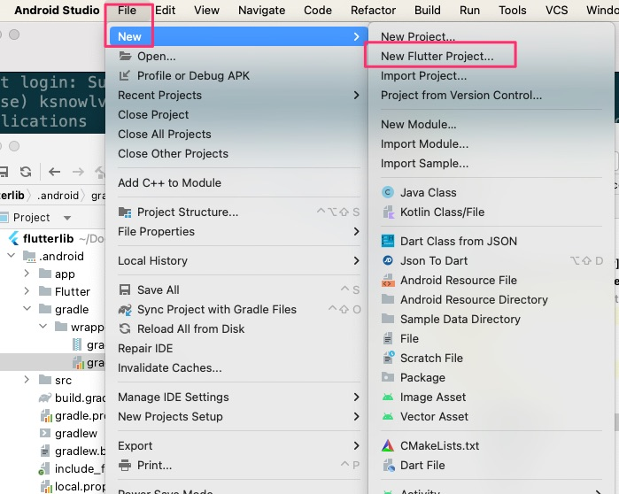
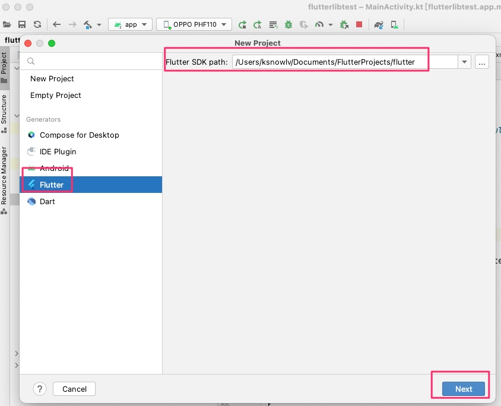
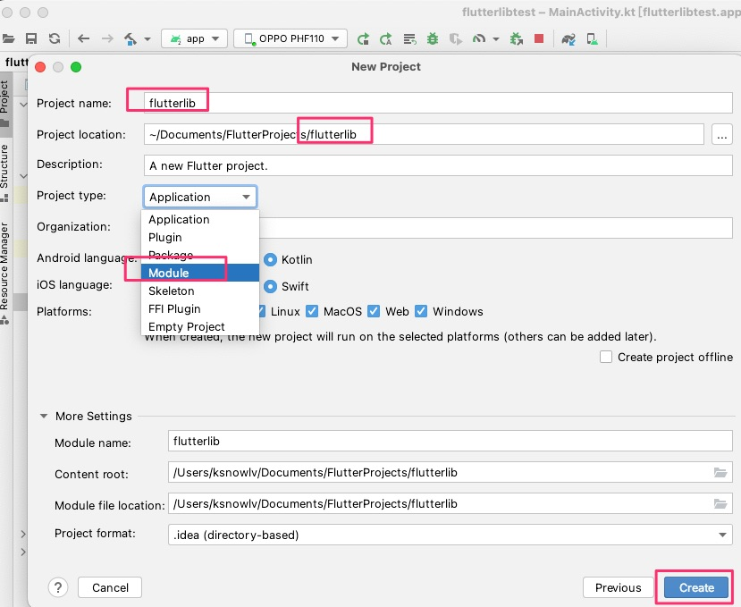
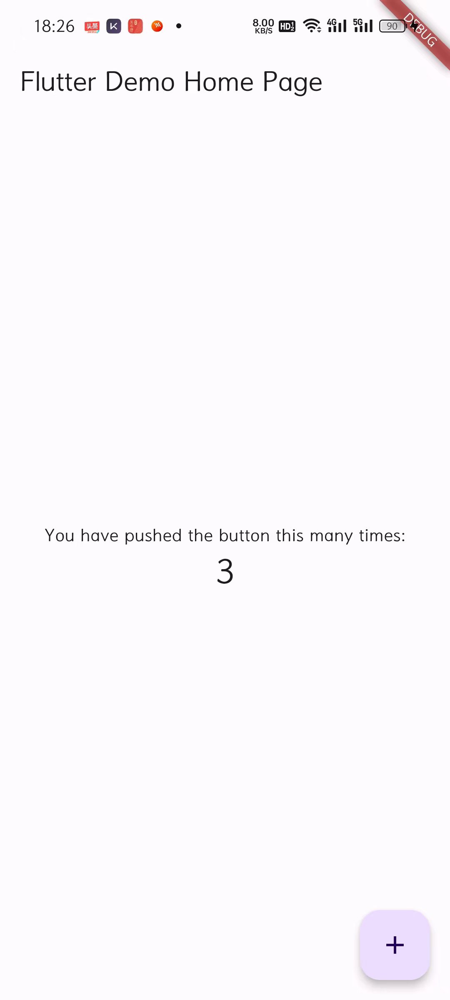

<!--more-->

flutter模块嵌入到Android原生项目，可以使用AAR集成，也可以以源码集成，在实际项目中，一般选择后者居多。

 当然，你要选择AAR集成，也很好。


### 一.Mac flutter环境搭建

```shell
(base) ksnowlv@MacBook-Pro-3 ~ % flutter doctor
Doctor summary (to see all details, run flutter doctor -v):
[✓] Flutter (Channel stable, 3.19.5, on macOS 14.4.1 23E224 darwin-x64, locale zh-Hans-CN)
[✓] Android toolchain - develop for Android devices (Android SDK version 34.0.0)
[✓] Xcode - develop for iOS and macOS (Xcode 15.3)
[✓] Chrome - develop for the web
[✓] Android Studio (version 2023.2)
[✓] VS Code (version 1.88.1)
[✓] Connected device (3 available)
[✓] Network resources

• No issues found!
(base) ksnowlv@MacBook-Pro-3 ~ % 
```
Mac下XCode，Android Studio,VSCode下的flutter环境搭建完毕。

### 二.flutter模块

我们使用Android Studio创建flutter模块， 打开File菜单，选择New，点击New Flutter Project


选择flutter类型的项目

点击Next，进入下图页面


输入flutter模块名称：flutterlib,选择项目类型为Module,完成flutter模块的创建。

当然，也可以使用命令行**flutter create -t module**创建

```shell
(base) ksnowlv@MacBook-Pro-3 Movies % flutter create -t module flutterlib
Developer identity "Apple Development: yy (xxx)" selected for iOS code signing
Creating project flutterlib...
Resolving dependencies in flutterlib... 
Got dependencies in flutterlib.
Developer identity "Apple Development: yy (xxx)" selected for iOS code signing
Developer identity "Apple Development: yy (xxx)" selected for iOS code signing
Wrote 12 files.

All done!
Your module code is in flutterlib/lib/main.dart.
```


### 三.Android主工程flutterlibtest

#### 3.1.settings.gradle

添加flutterlib的依赖

```gradle
pluginManagement {
    repositories {
        google {
            content {
                includeGroupByRegex("com\\.android.*")
                includeGroupByRegex("com\\.google.*")
                includeGroupByRegex("androidx.*")
            }
        }
        mavenCentral()
        gradlePluginPortal()
    }
}
dependencyResolutionManagement {
//    repositoriesMode.set(RepositoriesMode.FAIL_ON_PROJECT_REPOS)表示 Gradle 会优先使用远程仓库，如果在远程仓库找不到依赖项，才会检查项目中的本地仓库。
    repositoriesMode.set(RepositoriesMode.PREFER_PROJECT) //RepositoriesMode.PREFER_PROJECT 表示 Gradle 会优先使用项目中的本地仓库，只有当本地仓库中找不到依赖项时才会去远程仓库查找。
    
    repositories {
        // 解决maven库中的android组件无法同步的问题，这块容易卡住，注意
        maven { url 'https://jitpack.io' }
        maven { url 'https://maven.aliyun.com/nexus/content/groups/public/' }
        maven { url 'https://maven.aliyun.com/repository/central' }
        maven { url 'https://maven.aliyun.com/nexus/content/repositories/google' }

        google()
        mavenCentral()
    }
}

rootProject.name = "flutterlibtest"
include ':app'

//以下为新增部分！！！
//将 flutterlib模块作为子项目添加到宿主应用的settings.gradle 中
setBinding(new Binding([gradle: this]))
evaluate(new File(settingsDir.parentFile, 'flutterlib/.android/include_flutter.groovy'))

//把flutterlib显示在Android原生项目中，方便查看代码，调试等。
include "flutterlib"
project(':flutterlib').projectDir = new File('../flutterlib')

```


#### 3.2 flutterlibtest项目的build.gradle

```gradle
// Top-level build file where you can add configuration options common to all sub-projects/modules.
plugins {
alias(libs.plugins.androidApplication) apply false
    alias(libs.plugins.jetbrainsKotlinAndroid) apply false
}


allprojects {
    repositories {
        // 解决maven库中的android组件无法同步的问题，这块容易卡住，注意
        maven { url 'https://jitpack.io' }
        maven { url 'https://maven.aliyun.com/nexus/content/groups/public/' }
        maven { url 'https://maven.aliyun.com/repository/central' }
        maven { url 'https://maven.aliyun.com/nexus/content/repositories/google' }
        google()
        mavenCentral()
    }
}

task clean(type: Delete) {
    delete rootProject.buildDir
}


```


#### 3.3 app目录下build.gradle

app下的build.gradle文件中，添加flutter模块的依赖

```gradle
dependencies {

    implementation libs.androidx.core.ktx
    implementation libs.androidx.lifecycle.runtime.ktx
    implementation libs.androidx.activity.compose
    ...
    
    //
    implementation project(':flutter')
}
```

gradle同步后，项目同步编译成功。

#### 3.4 AndroidManifest.xml添加FlutterActivity

```xml

    <activity
        android:name="io.flutter.embedding.android.FlutterActivity"
        android:configChanges="orientation|keyboardHidden|keyboard|screenSize|locale|layoutDirection|fontScale|screenLayout|density|uiMode"
        android:hardwareAccelerated="true"
        android:windowSoftInputMode="adjustResize" >
    </activity>

```

#### 3.5 MainActivity.kt添加跳转FlutterActivity

```kotlin

class MainActivity : ComponentActivity() {
    override fun onCreate(savedInstanceState: Bundle?) {
        super.onCreate(savedInstanceState)
        setContent {
            FlutterlibtestTheme {
                // A surface container using the 'background' color from the theme
                Surface(
                    modifier = Modifier.fillMaxSize(),
                    color = MaterialTheme.colorScheme.background
                ) {
                    Greeting("Android")
                }

                //新增按钮及跳转FlutterActivity
                ButtonWithClickEvent(context = this)
            }
        }
    }
}

@Composable
fun Greeting(name: String, modifier: Modifier = Modifier) {
    Text(
        text = "Hello $name!",
        modifier = modifier
    )
}

@Preview(showBackground = true)
@Composable
fun GreetingPreview() {
    FlutterlibtestTheme {
        Greeting("Android")
    }
}


//新增按钮及跳转FlutterActivity
@Composable
fun ButtonWithClickEvent(context: Context) {
    val launcher = rememberLauncherForActivityResult(ActivityResultContracts.StartActivityForResult()) { result ->
        // 在这里处理从FlutterActivity返回的结果
    }
    Box(
        contentAlignment = Alignment.Center,
        modifier = Modifier.fillMaxSize()
    ) {
        Button(
            onClick  = {
                var intent = Intent(context, FlutterActivity::class.java)
                launcher.launch(intent)


            },
            modifier = Modifier.padding(16.dp)
        )
        {
            Text(text = "点击跳转FlutterActivity")
        }
    }
}

```

### 4.效果


点击按钮，跳转flutter页面。



跳转时，即使在真机上，你会发现跳转有些慢或者常出现卡顿现象，为什么呢？下次再叙；

### 5.其它

注意第一部分的Mac flutter环境搭建，不然，出现各种莫名其妙的的问题,试错试的头大~。


