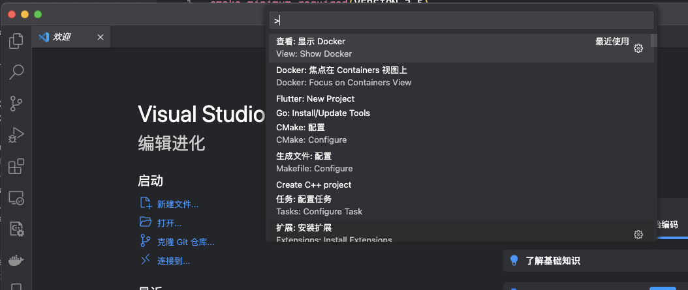
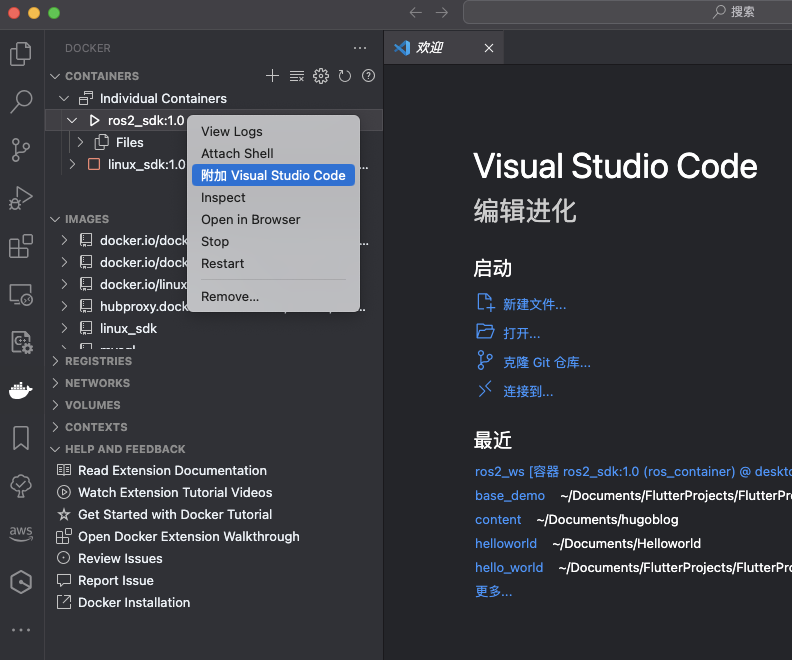

<!--more-->

### 1.安装VSCode

### 2.VSCode中安装docker插件
在**VSCode**扩展中找到**docker**插件，并安装重启。

### 3.启动ROS2容器服务

在前文中[ROS2容器服务](https://ksnowlv.github.io/post/ros/mac下通过docker中的linux配置和安装ros2/)启动容器服务

### 4.VSCode打开容器服务

Command+Shift+P（或者Ctrl+Shift+P）打开命令面板，选择 "Dokcer",




然后选择ros2_sdk:1.0容器，附加到Visual Studio Code 打开容器。

### 5.测试ros2容器服务

打开终端，开启ROS2 Python listener

```shell
root@acf5b27d6036:~/ros2_ws# ros2 run demo_nodes_py listener
[INFO] [1710589373.953308780] [listener]: I heard: [Hello World: 1]
[INFO] [1710589374.931733296] [listener]: I heard: [Hello World: 2]
[INFO] [1710589375.931589398] [listener]: I heard: [Hello World: 3]
[INFO] [1710589376.931793177] [listener]: I heard: [Hello World: 4]
[INFO] [1710589377.934030979] [listener]: I heard: [Hello World: 5]
[INFO] [1710589378.931360876] [listener]: I heard: [Hello World: 6]
[INFO] [1710589379.931520993] [listener]: I heard: [Hello World: 7]
```

打开另一终端,开启ROS2 C++ talker.

```shell
root@acf5b27d6036:~/ros2_ws# ros2 run demo_nodes_cpp talker
[INFO] [1710589373.930197135] [talker]: Publishing: 'Hello World: 1'
[INFO] [1710589374.930331507] [talker]: Publishing: 'Hello World: 2'
[INFO] [1710589375.930224145] [talker]: Publishing: 'Hello World: 3'
[INFO] [1710589376.930231354] [talker]: Publishing: 'Hello World: 4'
[INFO] [1710589377.930409419] [talker]: Publishing: 'Hello World: 5'
[INFO] [1710589378.930200203] [talker]: Publishing: 'Hello World: 6'
[INFO] [1710589379.930267633] [talker]: Publishing: 'Hello World: 7'
```

